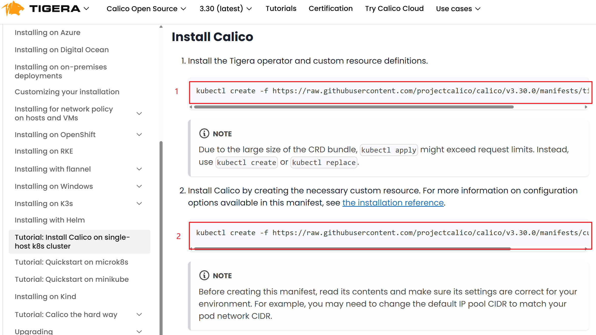

# kubeadm部署单Master节点kubernetes集群

## kubernetes 1.28.15 部署环境准备

### 主机操作系统说明

| 序号 |         操作系统及版本         |             备注              |
| :--: | :----------------------------: | :---------------------------: |
|  1   | Debian GNU/Linux 12 (bookworm) | Debian 6.1.135-1 (2025-04-25) |


### 主机硬件配置说明

| 需求 | CPU  | 内存 | 硬盘  | 角色         | 主机名       |
| ---- | ---- | ---- | ----- | ------------ | ------------ |
| 值   | 4C   | 4G   | 100GB | master       | k8s-master01 |
| 值   | 4C   | 4G   | 100GB | worker(node) | k8s-worker01 |
| 值   | 4C   | 4G   | 100GB | worker(node) | k8s-worker02 |

### 主机配置

#### 配置root 账号可以直接登录

```shell
# 虚机配置过程，已经提炼为shell脚本，参考 VM/init_vm.sh

# vim /etc/ssh/sshd_config
PermitRootLogin yes
systemctl restart ssh
```

#### 主机名配置

```shell
# master节点,名称为k8s-master01
hostnamectl set-hostname k8s-master01

# worker1节点,名称为k8s-worker01
hostnamectl set-hostname k8s-worker01

# worker2节点,名称为k8s-worker02
hostnamectl set-hostname k8s-worker02
```

#### 主机IP地址配置

NetworkManager 的配置文件位于 /etc/NetworkManager/system-connections/ 目录下。可以通过编辑配置文件来设置静态 IP。

```shell
# 方式1：修改以下部分：
cd /etc/NetworkManager/system-connections/
mv "Wired connection 1" master01_ens33.nmconnection

[ipv4]
method=manual
address1=192.168.52.129/24,192.168.52.2
dns=192.168.52.2;8.8.8.8;

# 运行以下命令重新加载配置：
sudo nmcli connection reload
sudo nmcli connection down master01_ens33
sudo nmcli connection up master01_ens33

# 方式2：命令修改以下部分：
cd /etc/NetworkManager/system-connections/
mv "Wired connection 1" master01_ens33.nmconnection
sudo nmcli connection reload

sudo nmcli connection modify master01_ens33 \
    ipv4.method manual \
    ipv4.addresses 192.168.52.129/24 \
    ipv4.gateway 192.168.52.2 \
    ipv4.dns "192.168.52.2 8.8.8.8"

# 激活连接
sudo nmcli connection down master01_ens33
sudo nmcli connection up master01_ens33
sudo nmcli connection down master01_ens33 && sudo nmcli connection up master01_ens33
```

#### 主机名与IP地址解析

```shell
# 所有集群主机均需要进行配置。
# cat /etc/hosts
127.0.0.1   localhost localhost.localdomain localhost4 localhost4.localdomain4
::1         localhost localhost.localdomain localhost6 localhost6.localdomain6
192.168.52.129 k8s-master01
192.168.52.140 k8s-worker01
192.168.52.141 k8s-worker02
# 验证： ping -c 4 k8s-master01 && ping -c 4 k8s-worker01 && ping -c 4 k8s-worker02
```

#### 防火墙配置

```shell
# 所有主机均需要操作。
# 在 Debian 12 中，默认的防火墙工具是 nftables（替代了之前的 iptables）。以下是关闭防火墙和查看防火墙状态的命令：
# 检查 nftables 状态
sudo nft list ruleset

# 检查 firewalld 状态（如果安装了）
sudo firewall-cmd --state

# 检查 ufw 状态（如果安装了）
sudo ufw status

systemctl status nftables.service
```

#### SELINUX配置

```shell
# 所有主机均需要操作。修改SELinux配置需要重启操作系统。
# sed -ri 's/SELINUX=enforcing/SELINUX=disabled/' /etc/selinux/config
# 在 Debian 系统中，默认不安装 SELinux。
sudo aa-status
# 如果输出显示 apparmor module is loaded，表示 AppArmor 正在运行。
# 在 Debian 系统上安装 Kubernetes 时，通常不需要关闭 AppArmor。AppArmor 与 Kubernetes 和常见容器运行时兼容，
# 并提供额外的安全性。只有在特定情况下（如配置不当或兼容性问题）才需要关闭 AppArmor。
```

#### 时间同步配置

```shell
# 所有主机均需要操作。最小化安装系统需要安装ntpdate软件。
# apt -y install ntpdate
crontab -l
0 */1 * * * /usr/sbin/ntpdate time1.aliyun.com
```

#### 升级操作系统内核

```shell
# 所有主机均需要操作。
sudo apt update
sudo apt upgrade
```

#### 配置内核转发及网桥过滤

```shell
# 所有主机均需要操作。
# 添加网桥过滤及内核转发配置文件
# cat /etc/sysctl.d/k8s.conf
net.bridge.bridge-nf-call-ip6tables = 1
net.bridge.bridge-nf-call-iptables = 1
net.ipv4.ip_forward = 1
vm.swappiness = 0

# 加载br_netfilter模块
modprobe br_netfilter

# 查看是否加载
# lsmod | grep br_netfilter
br_netfilter           22256  0
bridge                151336  1 br_netfilter


# 加载网桥过滤及内核转发配置文件
# sysctl -p /etc/sysctl.d/k8s.conf
net.bridge.bridge-nf-call-ip6tables = 1
net.bridge.bridge-nf-call-iptables = 1
net.ipv4.ip_forward = 1
vm.swappiness = 0
```

#### 安装ipset及ipvsadm

```shell
# 所有主机均需要操作。主要用于实现service转发。
# 安装ipset及ipvsadm
apt -y install ipset ipvsadm

# 配置ipvsadm模块加载方式
# 添加需要加载的模块，这里需要把br_netfilter也加上，减少一个配置内核转发及网桥过滤的单独服务。
cat > /etc/ipvsadm.rules <<EOF
#!/bin/bash
modprobe -- br_netfilter
modprobe -- ip_vs
modprobe -- ip_vs_rr
modprobe -- ip_vs_wrr
modprobe -- ip_vs_sh
modprobe -- nf_conntrack
EOF

# 授权、运行、检查是否加载
chmod 755 /etc/ipvsadm.rules && bash /etc/ipvsadm.rules && lsmod | grep -e ip_vs -e nf_conntrack

vim /etc/systemd/system/ipvsadm.service
# 将启动内容拷贝
[Unit]
Description=IPVS Load Balancer
After=network.target

[Service]
Type=oneshot
ExecStart=/bin/bash /etc/ipvsadm.rules
ExecStop=/sbin/ipvsadm -C
RemainAfterExit=yes

[Install]
WantedBy=multi-user.target

sudo systemctl enable ipvsadm
sudo systemctl start ipvsadm

sudo systemctl status ipvsadm
```

#### 关闭SWAP分区

```shell
# 修改完成后需要重启操作系统，如不重启，可临时关闭，命令为swapoff -a

# 永远关闭swap分区，需要重启操作系统
# cat /etc/fstab
......

# /dev/mapper/centos-swap swap                    swap    defaults        0 0

# 在上一行中行首添加#
```

### Docker准备

所有集群主机均需操作。
[Debian安装docker官网参考](https://docker.github.net.cn/engine/install/debian/#uninstall-docker-engine)

#### 卸载已安装decker

```shell
sudo apt-get purge docker-ce docker-ce-cli containerd.io docker-buildx-plugin docker-compose-plugin docker-ce-rootless-extras

sudo rm -rf /var/lib/docker
sudo rm -rf /var/lib/containerd
```

#### 安装docker

[阿里云docker源及安装配置参考](https://developer.aliyun.com/mirror/docker-ce?spm=a2c6h.13651102.0.0.57e31b11LDVOCk)

```shell
# step 1: 安装必要的一些系统工具
sudo apt-get update
sudo apt-get -y install ca-certificates curl gnupg

# step 2: 信任 Docker 的 GPG 公钥
sudo install -m 0755 -d /etc/apt/keyrings
curl -fsSL https://mirrors.aliyun.com/docker-ce/linux/debian/gpg | sudo gpg --dearmor -o /etc/apt/keyrings/docker.gpg
sudo chmod a+r /etc/apt/keyrings/docker.gpg

# Step 3: 写入软件源信息
echo \
  "deb [arch=$(dpkg --print-architecture) signed-by=/etc/apt/keyrings/docker.gpg] https://mirrors.aliyun.com/docker-ce/linux/debian \
  "$(. /etc/os-release && echo "$VERSION_CODENAME")" stable" | \
  sudo tee /etc/apt/sources.list.d/docker.list > /dev/null

# Step 4: 安装Docker
sudo apt-get update
sudo apt-get -y install docker-ce docker-ce-cli containerd.io docker-buildx-plugin docker-compose-plugin
```

#### 修改cgroup方式

```shell
# 在/etc/docker/daemon.json添加如下内容

# cat /etc/docker/daemon.json
{
    "exec-opts": ["native.cgroupdriver=systemd"]
}

# 重启docker
systemctl restart docker
```

#### 安装cri-dockerd

[Releases · Mirantis/cri-dockerd](https://github.com/Mirantis/cri-dockerd/releases)

```shell
# 每个节点都安装
wget https://github.com/Mirantis/cri-dockerd/releases/download/v0.3.17/cri-dockerd_0.3.17.3-0.debian-bookworm_amd64.deb

dpkg -i cri-dockerd_0.3.17.3-0.debian-bookworm_amd64.deb

dpkg -l | grep cri-docker

# vim /usr/lib/systemd/system/cri-docker.service

# 修改第10行内容
# --pod-infra-container-image：指定 Kubernetes 使用的 pause 容器镜像，确保 Pod 的基础功能正常运行。
# --container-runtime-endpoint：指定 cri-docker 与容器运行时的通信方式，确保 Kubernetes 能够管理容器。
ExecStart=/usr/bin/cri-dockerd --pod-infra-container-image=registry.k8s.io/pause:3.9 --container-runtime-endpoint fd://

sudo systemctl start cri-docker
sudo systemctl enable cri-docker

sudo systemctl status cri-docker
```

### kubernetes 1.28.X  集群部署

#### 集群软件及版本说明

|          | kubeadm                | kubelet                                       | kubectl                |
| -------- | ---------------------- | --------------------------------------------- | ---------------------- |
| 版本     | 1.28.X                 | 1.28.X                                        | 1.28.X                 |
| 安装位置 | 集群所有主机           | 集群所有主机                                  | 集群所有主机           |
| 作用     | 初始化集群、管理集群等 | 用于接收api-server指令，对pod生命周期进行管理 | 集群应用命令行管理工具 |

#### 阿里源安装集群软件

```shell
# debian 系统安装
apt-get update && apt-get install -y apt-transport-https
curl -fsSL https://mirrors.aliyun.com/kubernetes-new/core/stable/v1.28/deb/Release.key |
    gpg --dearmor -o /etc/apt/keyrings/kubernetes-apt-keyring.gpg
echo "deb [signed-by=/etc/apt/keyrings/kubernetes-apt-keyring.gpg] https://mirrors.aliyun.com/kubernetes-new/core/stable/v1.28/deb/ /" |
    tee /etc/apt/sources.list.d/kubernetes.list
apt-get update
apt-get install -y kubelet kubeadm kubectl
```

#### 配置kubelet

为了实现docker使用的cgroupdriver与kubelet使用的cgroup的一致性，建议修改如下文件内容。

```shell
# vim /etc/sysconfig/kubelet
KUBELET_EXTRA_ARGS="--cgroup-driver=systemd"

# debian 系统 /etc/default/kubelet

systemctl enable kubelet
```

#### 集群镜像准备

> **必须科学上网，否则都是徒劳**

```shell
# 查看要下载的镜像信息
kubeadm config images list

# 使用下面的命令进行镜像下载
kubeadm config images pull  --cri-socket unix:///var/run/cri-dockerd.sock
```

#### 集群初始化

```shell
kubeadm init --kubernetes-version=v1.28.15 --pod-network-cidr=10.244.0.0/16 --apiserver-advertise-address=192.168.52.129  --cri-socket unix:///var/run/cri-dockerd.sock

# 如果不添加--cri-socket选项，则会报错，内容如下：
# Found multiple CRI endpoints on the host. Please define which one do you wish to use by setting the 'criSocket' field in the kubeadm configuration file: unix:///var/run/containerd/containerd.sock, unix:///var/run/cri-dockerd.sock
# To see the stack trace of this error execute with --v=5 or higher
```

```shell
# 配置输出
[init] Using Kubernetes version: v1.28.15
[preflight] Running pre-flight checks
[preflight] Pulling images required for setting up a Kubernetes cluster
[preflight] This might take a minute or two, depending on the speed of your internet connection
[preflight] You can also perform this action in beforehand using 'kubeadm config images pull'
W0504 12:48:00.026524    2144 checks.go:835] detected that the sandbox image "registry.k8s.io/pause:3.8" of the container runtime is inconsistent with that used by kubeadm. It is recommended that using "registry.k8s.io/pause:3.9" as the CRI sandbox image.
[certs] Using certificateDir folder "/etc/kubernetes/pki"
[certs] Generating "ca" certificate and key
[certs] Generating "apiserver" certificate and key
[certs] apiserver serving cert is signed for DNS names [kubernetes kubernetes.default kubernetes.default.svc kubernetes.default.svc.cluster.local master01] and IPs [10.96.0.1 192.168.52.129]
[certs] Generating "apiserver-kubelet-client" certificate and key
[certs] Generating "front-proxy-ca" certificate and key
[certs] Generating "front-proxy-client" certificate and key
[certs] Generating "etcd/ca" certificate and key
[certs] Generating "etcd/server" certificate and key
[certs] etcd/server serving cert is signed for DNS names [localhost master01] and IPs [192.168.52.129 127.0.0.1 ::1]
[certs] Generating "etcd/peer" certificate and key
[certs] etcd/peer serving cert is signed for DNS names [localhost master01] and IPs [192.168.52.129 127.0.0.1 ::1]
[certs] Generating "etcd/healthcheck-client" certificate and key
[certs] Generating "apiserver-etcd-client" certificate and key
[certs] Generating "sa" key and public key
[kubeconfig] Using kubeconfig folder "/etc/kubernetes"
[kubeconfig] Writing "admin.conf" kubeconfig file
[kubeconfig] Writing "kubelet.conf" kubeconfig file
[kubeconfig] Writing "controller-manager.conf" kubeconfig file
[kubeconfig] Writing "scheduler.conf" kubeconfig file
[etcd] Creating static Pod manifest for local etcd in "/etc/kubernetes/manifests"
[control-plane] Using manifest folder "/etc/kubernetes/manifests"
[control-plane] Creating static Pod manifest for "kube-apiserver"
[control-plane] Creating static Pod manifest for "kube-controller-manager"
[control-plane] Creating static Pod manifest for "kube-scheduler"
[kubelet-start] Writing kubelet environment file with flags to file "/var/lib/kubelet/kubeadm-flags.env"
[kubelet-start] Writing kubelet configuration to file "/var/lib/kubelet/config.yaml"
[kubelet-start] Starting the kubelet
[wait-control-plane] Waiting for the kubelet to boot up the control plane as static Pods from directory "/etc/kubernetes/manifests". This can take up to 4m0s
[apiclient] All control plane components are healthy after 21.505666 seconds
[upload-config] Storing the configuration used in ConfigMap "kubeadm-config" in the "kube-system" Namespace
[kubelet] Creating a ConfigMap "kubelet-config" in namespace kube-system with the configuration for the kubelets in the cluster
[upload-certs] Skipping phase. Please see --upload-certs
[mark-control-plane] Marking the node master01 as control-plane by adding the labels: [node-role.kubernetes.io/control-plane node.kubernetes.io/exclude-from-external-load-balancers]
[mark-control-plane] Marking the node master01 as control-plane by adding the taints [node-role.kubernetes.io/control-plane:NoSchedule]
[bootstrap-token] Using token: o4l5gb.8jem7v7x9upd376t
[bootstrap-token] Configuring bootstrap tokens, cluster-info ConfigMap, RBAC Roles
[bootstrap-token] Configured RBAC rules to allow Node Bootstrap tokens to get nodes
[bootstrap-token] Configured RBAC rules to allow Node Bootstrap tokens to post CSRs in order for nodes to get long term certificate credentials
[bootstrap-token] Configured RBAC rules to allow the csrapprover controller automatically approve CSRs from a Node Bootstrap Token
[bootstrap-token] Configured RBAC rules to allow certificate rotation for all node client certificates in the cluster
[bootstrap-token] Creating the "cluster-info" ConfigMap in the "kube-public" namespace
[kubelet-finalize] Updating "/etc/kubernetes/kubelet.conf" to point to a rotatable kubelet client certificate and key
[addons] Applied essential addon: CoreDNS
[addons] Applied essential addon: kube-proxy

Your Kubernetes control-plane has initialized successfully!

To start using your cluster, you need to run the following as a regular user:

  mkdir -p $HOME/.kube
  sudo cp -i /etc/kubernetes/admin.conf $HOME/.kube/config
  sudo chown $(id -u):$(id -g) $HOME/.kube/config

Alternatively, if you are the root user, you can run:

  export KUBECONFIG=/etc/kubernetes/admin.conf

You should now deploy a pod network to the cluster.
Run "kubectl apply -f [podnetwork].yaml" with one of the options listed at:
  https://kubernetes.io/docs/concepts/cluster-administration/addons/

Then you can join any number of worker nodes by running the following on each as root:

kubeadm join 192.168.52.129:6443 --token ghwg0j.hwc8l4o3h8j65le4 \
        --discovery-token-ca-cert-hash sha256:31ae1608dded0e8a442eaa653e52fc371f46bcbe3b047aa4a7a0a218d2601a50
```

#### 集群应用客户端管理集群文件准备

``````shell
# 根据提示执行命令
[root@k8s-master01 ~]# mkdir -p $HOME/.kube
[root@k8s-master01 ~]# cp -i /etc/kubernetes/admin.conf $HOME/.kube/config
[root@k8s-master01 ~]# chown $(id -u):$(id -g) $HOME/.kube/config
[root@k8s-master01 ~]# export KUBECONFIG=/etc/kubernetes/admin.conf
``````

#### 集群网络插件部署 calico

> 使用calico部署集群网络
>
> 安装参考网址：[Tutorial: Install Calico on single-host k8s cluster | Calico Documentation](https://docs.tigera.io/calico/latest/getting-started/kubernetes/k8s-single-node)



```shell
# 应用operator资源清单文件
[root@k8s-master01 ~]# kubectl create -f https://raw.githubusercontent.com/projectcalico/calico/v3.30.0/manifests/tigera-operator.yaml
```

```shell
# 下载自定义资源文件
[root@k8s-master01 ~]# wget https://raw.githubusercontent.com/projectcalico/calico/v3.30.0/manifests/custom-resources.yaml

# 修改配置
# 修改文件第13行，修改为使用kubeadm init ----pod-network-cidr对应的IP地址段
[root@k8s-master01 ~]# vim custom-resources.yaml
......
 11     ipPools:
 12     - blockSize: 26
 13       cidr: 10.244.0.0/16 
 14       encapsulation: VXLANCrossSubnet
......

# 应用资源清单文件
[root@k8s-master01 ~]# kubectl create -f custom-resources.yaml
```


```shell
# 监视calico-sysem命名空间中pod运行情况
[root@k8s-master01 ~]# watch kubectl get pods -n calico-system
```

>Wait until each pod has the `STATUS` of `Running`.
>
>1、科学上网很重要
>
>2、重启虚机，重启主机，科学上网断开重连


```shell
# 已经全部运行
[root@k8s-master01 ~]# kubectl get pods -n calico-system
NAME                                       READY   STATUS    RESTARTS       AGE
calico-kube-controllers-789b9578b6-296xf   1/1     Running   11 (21h ago)   2d21h
calico-node-hrqlr                          1/1     Running   5 (21h ago)    2d14h
calico-node-l7dhd                          1/1     Running   5 (21h ago)    2d14h
calico-node-vll2x                          1/1     Running   5 (21h ago)    2d14h
calico-typha-5dd4d5c669-49svd              1/1     Running   5 (21h ago)    2d14h
calico-typha-5dd4d5c669-7mcsb              1/1     Running   5 (21h ago)    2d14h
csi-node-driver-fcx7c                      2/2     Running   10 (21h ago)   2d19h
csi-node-driver-gwsql                      2/2     Running   10 (21h ago)   2d21h
csi-node-driver-qlx46                      2/2     Running   10 (21h ago)   2d19h
goldmane-8456f8bf4d-vdc4h                  1/1     Running   5 (21h ago)    2d21h
whisker-594579fbdd-dtbjt                   2/2     Running   10 (21h ago)   2d14h
```

#### 集群工作节点添加

>  因容器镜像下载较慢，可能会导致报错，主要错误为没有准备好cni（集群网络插件），如有网络，请耐心等待即可。

```shell
[root@k8s-worker01 ~]# kubeadm join 192.168.52.129:6443 --token ghwg0j.hwc8l4o3h8j65le4 \
        --discovery-token-ca-cert-hash sha256:31ae1608dded0e8a442eaa653e52fc371f46bcbe3b047aa4a7a0a218d2601a50
```

```shell
[root@k8s-worker02 ~]# kubeadm join 192.168.52.129:6443 --token ghwg0j.hwc8l4o3h8j65le4 \
        --discovery-token-ca-cert-hash sha256:31ae1608dded0e8a442eaa653e52fc371f46bcbe3b047aa4a7a0a218d2601a50
```


### 验证集群可用性

```shell
# 查看所有的节点
[root@k8s-master01 ~]# kubectl get nodes
NAME           STATUS   ROLES           AGE     VERSION
k8s-master01   Ready    control-plane   2d22h   v1.28.15
k8s-worker01   Ready    <none>          2d19h   v1.28.15
k8s-worker02   Ready    <none>          2d19h   v1.28.15
```


```shell
# 查看集群健康情况
[root@k8s-master01 ~]# kubectl get cs
Warning: v1 ComponentStatus is deprecated in v1.19+
NAME                 STATUS    MESSAGE   ERROR
controller-manager   Healthy   ok
scheduler            Healthy   ok
etcd-0               Healthy   ok
```


```shell
# 查看kubernetes集群pod运行情况
[root@k8s-master01 ~]# kubectl get pods -n kube-system
NAME                                   READY   STATUS    RESTARTS       AGE
coredns-5dd5756b68-gbgsh               1/1     Running   11 (21h ago)   2d22h
coredns-5dd5756b68-pm85d               1/1     Running   11 (21h ago)   2d22h
etcd-k8s-master01                      1/1     Running   11 (21h ago)   2d22h
kube-apiserver-k8s-master01            1/1     Running   12 (21h ago)   2d22h
kube-controller-manager-k8s-master01   1/1     Running   11 (21h ago)   2d22h
kube-proxy-h7s9b                       1/1     Running   5 (21h ago)    2d14h
kube-proxy-qt8px                       1/1     Running   5 (21h ago)    2d14h
kube-proxy-wlvrg                       1/1     Running   5 (21h ago)    2d14h
kube-scheduler-k8s-master01            1/1     Running   11 (21h ago)   2d22h
```


```shell
# 再次查看calico-system命名空间中pod运行情况。
[root@k8s-master01 ~]# kubectl get pods -n calico-system
NAME                                       READY   STATUS    RESTARTS       AGE
calico-kube-controllers-789b9578b6-296xf   1/1     Running   11 (21h ago)   2d22h
calico-node-hrqlr                          1/1     Running   5 (21h ago)    2d14h
calico-node-l7dhd                          1/1     Running   5 (21h ago)    2d14h
calico-node-vll2x                          1/1     Running   5 (21h ago)    2d14h
calico-typha-5dd4d5c669-49svd              1/1     Running   5 (21h ago)    2d14h
calico-typha-5dd4d5c669-7mcsb              1/1     Running   5 (21h ago)    2d14h
csi-node-driver-fcx7c                      2/2     Running   10 (21h ago)   2d19h
csi-node-driver-gwsql                      2/2     Running   10 (21h ago)   2d22h
csi-node-driver-qlx46                      2/2     Running   10 (21h ago)   2d19h
goldmane-8456f8bf4d-vdc4h                  1/1     Running   5 (21h ago)    2d22h
whisker-594579fbdd-dtbjt                   2/2     Running   10 (21h ago)   2d14h
```


## 环境准备过程中问题排查

### IP地址配置的问题

**/etc/network/interfaces  这个下面不要做配置，不生效.**

使用界面做的配置
Debian 12 默认使用 NetworkManager 或 systemd-networkd 管理网络，而不是传统的 ifupdown 工具。
如果 NetworkManager 或 systemd-networkd 正在管理网络接口，/etc/network/interfaces 的配置会被忽略。

以下是排查过程
NetworkManager 正在管理该接口

```shell
root@master01:~# nmcli device status
DEVICE  TYPE      STATE                   CONNECTION
ens33   ethernet  connected               Wired connection 1
lo      loopback  connected (externally)  lo

# 查看 systemd-networkd 是否启用
root@master01:~# systemctl status systemd-networkd
○ systemd-networkd.service - Network Configuration
     Loaded: loaded (/lib/systemd/system/systemd-networkd.service; disabled; preset: enabled)
     Active: inactive (dead)
TriggeredBy: ○ systemd-networkd.socket
       Docs: man:systemd-networkd.service(8)
             man:org.freedesktop.network1(5)
```

### 虚机重启后，ipvs和br_netfilter未被加载

虚机重启后，需要重新加载`br_netfilter`模块。

将 modprobe -- br_netfilter 命令加入到 /etc/ipvsadm.rules

```shell
vim /etc/systemd/system/ipvsadm.service
# 将启动内容拷贝
[Unit]
Description=IPVS Load Balancer
After=network.target

[Service]
Type=oneshot
# 启动时不能执行这条命令：/sbin/ipvsadm-restore < /etc/ipvsadm.rules
# 应该使用bash执行相应的规则文件
ExecStart=/bin/bash /etc/ipvsadm.rules
ExecStop=/sbin/ipvsadm -C
RemainAfterExit=yes

[Install]
WantedBy=multi-user.target
```

### [ERROR CRI]: container runtime is not running

```shell
# 初始化时报这个错
[init] Using Kubernetes version: v1.28.15
[preflight] Running pre-flight checks
error execution phase preflight: [preflight] Some fatal errors occurred:
        [ERROR CRI]: container runtime is not running: output: time="2025-05-04T11:52:11-04:00" level=fatal msg="validate service connection: validate CRI v1 runtime API for endpoint \"unix:///var/run/containerd/containerd.sock\": rpc error: code = Unimplemented desc = unknown service runtime.v1.RuntimeService"
, error: exit status 1
        [ERROR FileContent--proc-sys-net-bridge-bridge-nf-call-iptables]: /proc/sys/net/bridge/bridge-nf-call-iptables does not exist
[preflight] If you know what you are doing, you can make a check non-fatal with `--ignore-preflight-errors=...`
To see the stack trace of this error execute with --v=5 or higher
```

排查过程及解决方法，内核转发及网桥过滤模块没有加载，统一在`主机配置 > 安装ipset及ipvsadm`步骤进行优化了。

```shell
# 解决容器运行时问题
# (1) 检查 containerd.md 是否已安装并运行
# 运行以下命令检查 containerd.md 的状态：
sudo systemctl status containerd.md

# (2) 验证 containerd.md 配置
# 确保 containerd.md 的配置文件（通常位于 /etc/containerd.md/config.toml）正确配置了 CRI（容器运行时接口）。运行以下命令生成默认配置（如果配置文件不存在）：
sudo containerd.md config default | sudo tee /etc/containerd.md/config.toml

# (3) 重启 containerd.md
# 修改配置后，重启 containerd.md：
sudo systemctl restart containerd.md

# (4) 验证 containerd.md 是否支持 CRI
# 运行以下命令验证 containerd.md 是否支持 CRI：
sudo ctr version
# 如果输出显示版本信息，说明 containerd.md 已正确配置。

# 解决 /proc/sys/net/bridge/bridge-nf-call-iptables 问题
# (1) 加载 br_netfilter 内核模块
# 运行以下命令加载 br_netfilter 模块：
sudo modprobe br_netfilter

# (2) 确保模块已加载
# 运行以下命令检查模块是否已加载：
lsmod | grep br_netfilter
# 如果输出显示 br_netfilter，说明模块已加载。

# (3) 确保 /proc/sys/net/bridge/bridge-nf-call-iptables 存在
# 运行以下命令检查文件是否存在：
cat /proc/sys/net/bridge/bridge-nf-call-iptables

# 如果文件不存在，可能是内核未正确配置。可以手动创建并设置值：
echo 1 | sudo tee /proc/sys/net/bridge/bridge-nf-call-iptables

# (4) 永久生效
# 为了确保每次重启后配置仍然有效，编辑 /etc/sysctl.conf 文件：
sudo vim /etc/sysctl.conf

# 添加以下内容：
net.bridge.bridge-nf-call-iptables = 1
net.bridge.bridge-nf-call-ip6tables = 1
# 保存并退出，然后应用配置：

sudo sysctl --system
```

### kubectl get pods 状态未Running

```shell
[root@k8s-master01 ~]# kubectl describe pod calico-apiserver-5b9b48d497-5ck29 -n calico-apiserver
network is not ready: container runtime network not ready: NetworkReady=false reason:NetworkPluginNotReady message:docker: network plugin is not ready: cni config uninitialized
```

```shell
# 这个目录下没有配置文件，说明没有安装 CNI
ls /etc/cni/net.d/

wget https://docs.projectcalico.org/manifests/calico.yaml
# 修改配置文件中的这个配置项
- name: CALICO_IPV4POOL_CIDR
  value: "10.244.0.0/16"

kubectl apply -f calico.yaml
```

