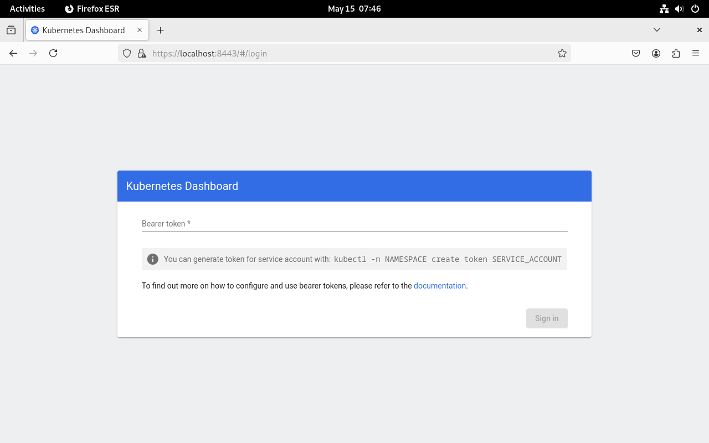
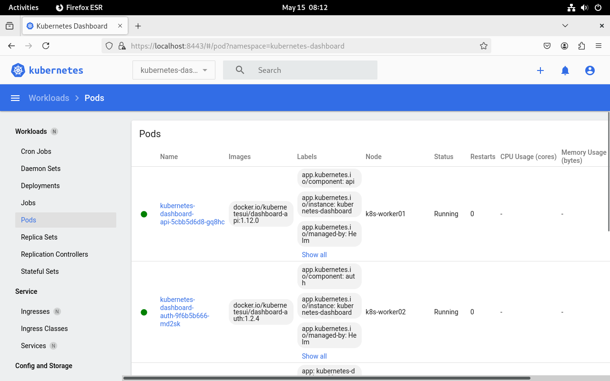
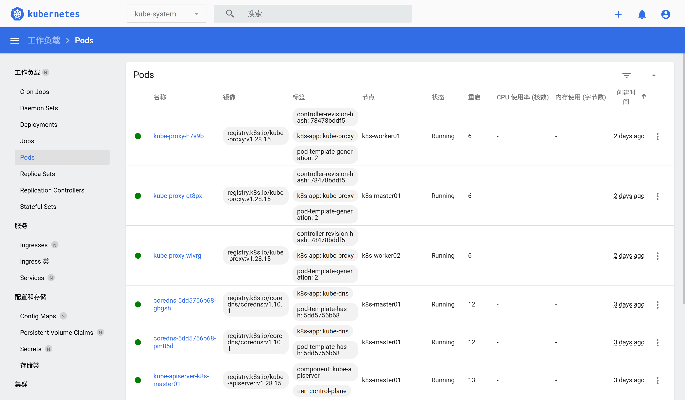
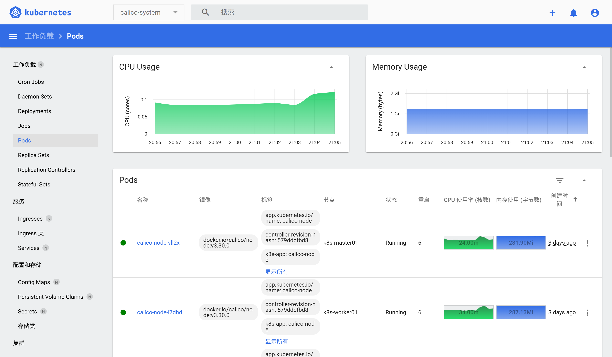

# Kubernetes集群UI及主机资源监控

## Kubernetes dashboard作用

- 通过dashboard能够直观了解Kubernetes集群中运行的资源对象
- 通过dashboard可以直接管理（创建、删除、重启等操作）资源对象

## 安装kubernetes dashboard

[参考链接：master的 dashboard/README.md ·kubernetes/dashboard](https://github.com/kubernetes/dashboard/blob/master/README.md)

[helm参考链接：Helm | Installing Helm](https://helm.sh/docs/intro/install/)


### 通过helm工具安装kubernetes dashboard

```shell
# 安装helm
curl https://baltocdn.com/helm/signing.asc | gpg --dearmor | sudo tee /usr/share/keyrings/helm.gpg > /dev/null
sudo apt-get install apt-transport-https --yes
echo "deb [arch=$(dpkg --print-architecture) signed-by=/usr/share/keyrings/helm.gpg] https://baltocdn.com/helm/stable/debian/ all main" | sudo tee /etc/apt/sources.list.d/helm-stable-debian.list
sudo apt-get update
sudo apt-get install helm
helm version

# 依赖科学上网
# Add kubernetes-dashboard repository
[root@k8s-master01 ~/dashboard]# helm repo add kubernetes-dashboard https://kubernetes.github.io/dashboard/
"kubernetes-dashboard" has been added to your repositories

# Deploy a Helm Release named "kubernetes-dashboard" using the kubernetes-dashboard chart
[root@k8s-master01 ~/dashboard]# helm upgrade --install kubernetes-dashboard kubernetes-dashboard/kubernetes-dashboard --create-namespace --namespace kubernetes-dashboard
```


### 命令执行后的回显

```shell
Release "kubernetes-dashboard" does not exist. Installing it now.
NAME: kubernetes-dashboard
LAST DEPLOYED: Thu May 15 04:25:22 2025
NAMESPACE: kubernetes-dashboard
STATUS: deployed
REVISION: 1
TEST SUITE: None
NOTES:
*************************************************************************************************
*** PLEASE BE PATIENT: Kubernetes Dashboard may need a few minutes to get up and become ready ***
*************************************************************************************************

Congratulations! You have just installed Kubernetes Dashboard in your cluster.

To access Dashboard run:
  kubectl -n kubernetes-dashboard port-forward svc/kubernetes-dashboard-kong-proxy 8443:443

NOTE: In case port-forward command does not work, make sure that kong service name is correct.
      Check the services in Kubernetes Dashboard namespace using:
        kubectl -n kubernetes-dashboard get svc

Dashboard will be available at:
  https://localhost:8443
```

### 查看服务是否已启动

```shell
watch kubectl get pods -n kubernetes-dashboard
# 等待所有服务都为Running状态
# 可以使用下面的命令查看具体的情况，注意观察Events:中d
# kubectl describe pods kubernetes-dashboard-api-7bcbc9b5bd-l76bc -n kubernetes-dashboard

# ImagePullBackOff 错误后，重新启动步骤如下
# 1、将副本数缩放到 0
kubectl scale deployment kubernetes-dashboard-auth --replicas=0 -n kubernetes-dashboard

# 2、将副本数恢复到 1
kubectl scale deployment kubernetes-dashboard-auth --replicas=1 -n kubernetes-dashboard
```


### 浏览器localhost访问

```shell
[root@k8s-master01 ~/dashboard]#   kubectl -n kubernetes-dashboard port-forward svc/kubernetes-dashboard-kong-proxy 8443:443
Forwarding from 127.0.0.1:8443 -> 8443
Forwarding from [::1]:8443 -> 8443
Handling connection for 8443
Handling connection for 8443
E0515 07:19:42.893297   73613 portforward.go:409] an error occurred forwarding 8443 -> 8443: error forwarding port 8443 to pod 161802690a0f8d6f42e5761323b2aafa46ff37baf8eba8e44675e0ef760f08b7, uid : unable to do port forwarding: socat not found
```

以上日志说明环境缺少 `socat` ，安装之

```shell
sudo apt-get update
sudo apt-get install socat
```

登录界面



查看`kubernetes-dashboard`下的账户

```shell
kubectl -n kubernetes-dashboard get serviceaccounts
```

创建账户

```shell
[root@k8s-master01 ~]# kubectl -n kubernetes-dashboard create serviceaccount kubernetes-dashboard
serviceaccount/kubernetes-dashboard created
```

绑定角色权限

```shell
kubectl create clusterrolebinding kubernetes-dashboard-admin \
  --clusterrole=cluster-admin \
  --serviceaccount=kubernetes-dashboard:kubernetes-dashboard
```

生成 Token

```shell
kubectl -n kubernetes-dashboard create token kubernetes-dashboard
```

通过token成功访问



### 浏览器节点访问

**检查 NodePort 服务配置**

确保 `kubernetes-dashboard` 服务已正确配置为 `NodePort`，并且端口范围在 `30000-32767` 之间。

**检查服务配置**

运行以下命令，查看服务的配置：

```shell
kubectl -n kubernetes-dashboard get svc kubernetes-dashboard-kong-proxy -o yaml
```

确认以下字段：

- `spec.type` 应为 `NodePort`。
- `spec.ports[0].nodePort` 应为 `32000`。

如果配置不正确，可以通过以下命令更新：

```shell
kubectl -n kubernetes-dashboard patch svc kubernetes-dashboard-kong-proxy -p '{"spec":{"type":"NodePort","ports":[{"port":443,"targetPort":8443,"nodePort":32000}]}}'
```

**获取节点 IP**
运行以下命令，获取节点的 IP 地址：

```shell
kubectl get nodes -o wide
# 使用 EXTERNAL-IP 或 INTERNAL-IP 访问 Dashboard。
```

生成 Token

```shell
kubectl -n kubernetes-dashboard create token kubernetes-dashboard
```

通过token成功访问



## 安装metrics-server

使用metrics-server实现主机资源监控，它可以解决的问题：解决上图中CPU和内存使用情况的获取

[资源参考链接：Releases · kubernetes-sigs/metrics-server](https://github.com/kubernetes-sigs/metrics-server/releases)

### 通过配置文件进行安装

```shell
# 下载资源安装配置文件
wget https://github.com/kubernetes-sigs/metrics-server/releases/download/v0.7.2/components.yaml

# 因为在使用 metrics-server 过程中没有创建证书，所以添加非安全的tls配置
    spec:
      containers:
      - args:
        - --cert-dir=/tmp
        - --secure-port=10250
        - --kubelet-preferred-address-types=InternalIP,ExternalIP,Hostname
        - --kubelet-use-node-status-port
        - --metric-resolution=15s
        - --kubelet-insecure-tls   # 这一行为添加内容

# 安装之
[root@k8s-master01 ~/dashboard]# kubectl apply -f components.yaml
serviceaccount/metrics-server created
clusterrole.rbac.authorization.k8s.io/system:aggregated-metrics-reader created
clusterrole.rbac.authorization.k8s.io/system:metrics-server created
rolebinding.rbac.authorization.k8s.io/metrics-server-auth-reader created
clusterrolebinding.rbac.authorization.k8s.io/metrics-server:system:auth-delegator created
clusterrolebinding.rbac.authorization.k8s.io/system:metrics-server created
service/metrics-server created
deployment.apps/metrics-server created
apiservice.apiregistration.k8s.io/v1beta1.metrics.k8s.io created
```

### 验证及授权

```shell
[root@k8s-master01 ~/dashboard]# kubectl get pods -n kube-system
NAME                                   READY   STATUS    RESTARTS         AGE
coredns-5dd5756b68-gbgsh               1/1     Running   12 (4h11m ago)   3d8h
coredns-5dd5756b68-pm85d               1/1     Running   12 (4h11m ago)   3d8h
etcd-k8s-master01                      1/1     Running   12 (4h11m ago)   3d8h
kube-apiserver-k8s-master01            1/1     Running   13 (4h11m ago)   3d8h
kube-controller-manager-k8s-master01   1/1     Running   12 (4h11m ago)   3d8h
kube-proxy-h7s9b                       1/1     Running   6 (4h11m ago)    3d
kube-proxy-qt8px                       1/1     Running   6 (4h11m ago)    3d
kube-proxy-wlvrg                       1/1     Running   6 (4h11m ago)    3d
kube-scheduler-k8s-master01            1/1     Running   12 (4h11m ago)   3d8h
metrics-server-596474b58-697f8         1/1     Running   0                102s
```

```shell
[root@k8s-master01 ~/dashboard]# kubectl top pods -n kube-system
NAME                                   CPU(cores)   MEMORY(bytes)
coredns-5dd5756b68-gbgsh               2m           22Mi
coredns-5dd5756b68-pm85d               2m           51Mi
etcd-k8s-master01                      19m          128Mi
kube-apiserver-k8s-master01            42m          532Mi
kube-controller-manager-k8s-master01   11m          115Mi
kube-proxy-h7s9b                       1m           59Mi
kube-proxy-qt8px                       1m           50Mi
kube-proxy-wlvrg                       1m           52Mi
kube-scheduler-k8s-master01            3m           49Mi
metrics-server-596474b58-697f8         2m           22Mi
[root@k8s-master01 ~/dashboard]# kubectl top nodes -n kube-system
NAME           CPU(cores)   CPU%   MEMORY(bytes)   MEMORY%
k8s-master01   131m         3%     4385Mi          86%
k8s-worker01   41m          1%     2149Mi          76%
k8s-worker02   45m          1%     2241Mi          79%
```

