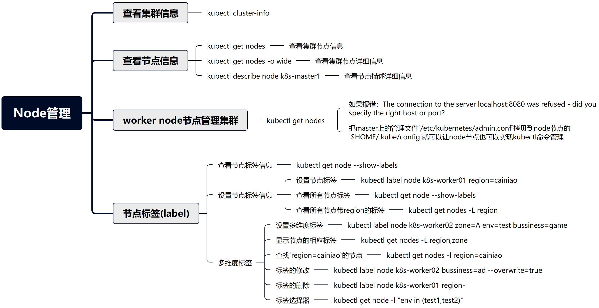

# Kubernetes集群Node管理



## 查看集群信息

```shell
[root@k8s-master01 ~]# kubectl cluster-info
Kubernetes control plane is running at https://192.168.52.129:6443
CoreDNS is running at https://192.168.52.129:6443/api/v1/namespaces/kube-system/services/kube-dns:dns/proxy

To further debug and diagnose cluster problems, use 'kubectl cluster-info dump'.
```

## 查看节点信息

### 查看集群节点信息

```shell
[root@k8s-master01 ~]# kubectl get nodes
NAME           STATUS   ROLES           AGE   VERSION
k8s-master01   Ready    control-plane   34h   v1.28.15
k8s-worker01   Ready    <none>          31h   v1.28.15
k8s-worker02   Ready    <none>          31h   v1.28.15
```


### 查看集群节点详细信息

```shell
[root@k8s-master01 ~]# kubectl get nodes -o wide
NAME           STATUS   ROLES           AGE   VERSION    INTERNAL-IP      EXTERNAL-IP   OS-IMAGE                         KERNEL-VERSION   CONTAINER-RUNTIME
k8s-master01   Ready    control-plane   34h   v1.28.15   192.168.52.129   <none>        Debian GNU/Linux 12 (bookworm)   6.1.0-34-amd64   docker://28.1.1
k8s-worker01   Ready    <none>          31h   v1.28.15   192.168.52.140   <none>        Debian GNU/Linux 12 (bookworm)   6.1.0-34-amd64   docker://28.1.1
k8s-worker02   Ready    <none>          31h   v1.28.15   192.168.52.141   <none>        Debian GNU/Linux 12 (bookworm)   6.1.0-34-amd64   docker://28.1.1
```


### 查看节点描述详细信息

```shell
[root@k8s-master01 ~]# kubectl describe node k8s-master01
Name:               k8s-master01
Roles:              control-plane
Labels:             beta.kubernetes.io/arch=amd64
                    beta.kubernetes.io/os=linux
                    kubernetes.io/arch=amd64
                    kubernetes.io/hostname=k8s-master01
                    kubernetes.io/os=linux
                    node-role.kubernetes.io/control-plane=
                    node.kubernetes.io/exclude-from-external-load-balancers=
Annotations:        csi.volume.kubernetes.io/nodeid: {"csi.tigera.io":"k8s-master01"}
                    kubeadm.alpha.kubernetes.io/cri-socket: unix:///var/run/cri-dockerd.sock
                    node.alpha.kubernetes.io/ttl: 0
                    projectcalico.org/IPv4Address: 192.168.52.129/24
                    projectcalico.org/IPv4VXLANTunnelAddr: 10.244.32.128
                    volumes.kubernetes.io/controller-managed-attach-detach: true
CreationTimestamp:  Mon, 12 May 2025 00:14:17 -0400
Taints:             node-role.kubernetes.io/control-plane:NoSchedule
Unschedulable:      false
Lease:
  HolderIdentity:  k8s-master01
  AcquireTime:     <unset>
  RenewTime:       Tue, 13 May 2025 11:01:37 -0400
Conditions:
  Type                 Status  LastHeartbeatTime                 LastTransitionTime                Reason                       Message
  ----                 ------  -----------------                 ------------------                ------                       -------
  NetworkUnavailable   False   Tue, 13 May 2025 10:56:59 -0400   Tue, 13 May 2025 10:56:59 -0400   CalicoIsUp                   Calico is running on this node
  MemoryPressure       False   Tue, 13 May 2025 10:56:41 -0400   Mon, 12 May 2025 00:14:16 -0400   KubeletHasSufficientMemory   kubelet has sufficient memory available
  DiskPressure         False   Tue, 13 May 2025 10:56:41 -0400   Mon, 12 May 2025 00:14:16 -0400   KubeletHasNoDiskPressure     kubelet has no disk pressure
  PIDPressure          False   Tue, 13 May 2025 10:56:41 -0400   Mon, 12 May 2025 00:14:16 -0400   KubeletHasSufficientPID      kubelet has sufficient PID available
  Ready                True    Tue, 13 May 2025 10:56:41 -0400   Mon, 12 May 2025 05:46:53 -0400   KubeletReady                 kubelet is posting ready status. AppArmor enabled
Addresses:
  InternalIP:  192.168.52.129
  Hostname:    k8s-master01
Capacity:
  cpu:                4
  ephemeral-storage:  101639152Ki
  hugepages-1Gi:      0
  hugepages-2Mi:      0
  memory:             5284488Ki
  pods:               110
Allocatable:
  cpu:                4
  ephemeral-storage:  93670642329
  hugepages-1Gi:      0
  hugepages-2Mi:      0
  memory:             5182088Ki
  pods:               110
System Info:
  Machine ID:                 f0d5fce3fd2f48b7ae64f003370f9732
  System UUID:                7bf54d56-e453-1f28-83fb-20ad43599d29
  Boot ID:                    ec68e796-ffa6-4076-89f4-ebaae9433dbb
  Kernel Version:             6.1.0-34-amd64
  OS Image:                   Debian GNU/Linux 12 (bookworm)
  Operating System:           linux
  Architecture:               amd64
  Container Runtime Version:  docker://28.1.1
  Kubelet Version:            v1.28.15
  Kube-Proxy Version:         v1.28.15
PodCIDR:                      10.244.0.0/24
PodCIDRs:                     10.244.0.0/24
Non-terminated Pods:          (15 in total)
  Namespace                   Name                                        CPU Requests  CPU Limits  Memory Requests  Memory Limits  Age
  ---------                   ----                                        ------------  ----------  ---------------  -------------  ---
  calico-apiserver            calico-apiserver-5b9b48d497-5ck29           0 (0%)        0 (0%)      0 (0%)           0 (0%)         34h
  calico-apiserver            calico-apiserver-5b9b48d497-lm8jm           0 (0%)        0 (0%)      0 (0%)           0 (0%)         34h
  calico-system               calico-kube-controllers-789b9578b6-296xf    0 (0%)        0 (0%)      0 (0%)           0 (0%)         34h
  calico-system               calico-node-vll2x                           250m (6%)     0 (0%)      0 (0%)           0 (0%)         27h
  calico-system               calico-typha-5dd4d5c669-7mcsb               0 (0%)        0 (0%)      0 (0%)           0 (0%)         27h
  calico-system               csi-node-driver-gwsql                       0 (0%)        0 (0%)      0 (0%)           0 (0%)         34h
  calico-system               goldmane-8456f8bf4d-vdc4h                   0 (0%)        0 (0%)      0 (0%)           0 (0%)         34h
  kube-system                 coredns-5dd5756b68-gbgsh                    100m (2%)     0 (0%)      70Mi (1%)        170Mi (3%)     34h
  kube-system                 coredns-5dd5756b68-pm85d                    100m (2%)     0 (0%)      70Mi (1%)        170Mi (3%)     34h
  kube-system                 etcd-k8s-master01                           100m (2%)     0 (0%)      100Mi (1%)       0 (0%)         34h
  kube-system                 kube-apiserver-k8s-master01                 250m (6%)     0 (0%)      0 (0%)           0 (0%)         34h
  kube-system                 kube-controller-manager-k8s-master01        200m (5%)     0 (0%)      0 (0%)           0 (0%)         34h
  kube-system                 kube-proxy-qt8px                            0 (0%)        0 (0%)      0 (0%)           0 (0%)         26h
  kube-system                 kube-scheduler-k8s-master01                 100m (2%)     0 (0%)      0 (0%)           0 (0%)         34h
  tigera-operator             tigera-operator-5b59476cb-gnd5z             0 (0%)        0 (0%)      0 (0%)           0 (0%)         34h
Allocated resources:
  (Total limits may be over 100 percent, i.e., overcommitted.)
  Resource           Requests     Limits
  --------           --------     ------
  cpu                1100m (27%)  0 (0%)
  memory             240Mi (4%)   340Mi (6%)
  ephemeral-storage  0 (0%)       0 (0%)
  hugepages-1Gi      0 (0%)       0 (0%)
  hugepages-2Mi      0 (0%)       0 (0%)
Events:
  Type     Reason                   Age                  From             Message
  ----     ------                   ----                 ----             -------
  Normal   Starting                 115m                 kube-proxy
  Normal   Starting                 4m56s                kube-proxy
  Normal   NodeHasSufficientMemory  117m (x8 over 117m)  kubelet          Node k8s-master01 status is now: NodeHasSufficientMemory
  Warning  InvalidDiskCapacity      117m                 kubelet          invalid capacity 0 on image filesystem
  Normal   NodeHasNoDiskPressure    117m (x7 over 117m)  kubelet          Node k8s-master01 status is now: NodeHasNoDiskPressure
  Normal   NodeHasSufficientPID     117m (x7 over 117m)  kubelet          Node k8s-master01 status is now: NodeHasSufficientPID
  Normal   NodeAllocatableEnforced  117m                 kubelet          Updated Node Allocatable limit across pods
  Normal   Starting                 117m                 kubelet          Starting kubelet.
  Normal   RegisteredNode           116m                 node-controller  Node k8s-master01 event: Registered Node k8s-master01 in Controller
  Normal   Starting                 5m7s                 kubelet          Starting kubelet.
  Warning  InvalidDiskCapacity      5m7s                 kubelet          invalid capacity 0 on image filesystem
  Normal   NodeHasSufficientMemory  5m7s (x8 over 5m7s)  kubelet          Node k8s-master01 status is now: NodeHasSufficientMemory
  Normal   NodeHasNoDiskPressure    5m7s (x7 over 5m7s)  kubelet          Node k8s-master01 status is now: NodeHasNoDiskPressure
  Normal   NodeHasSufficientPID     5m7s (x7 over 5m7s)  kubelet          Node k8s-master01 status is now: NodeHasSufficientPID
  Normal   NodeAllocatableEnforced  5m7s                 kubelet          Updated Node Allocatable limit across pods
  Normal   RegisteredNode           4m32s                node-controller  Node k8s-master01 event: Registered Node k8s-master01 in Controller
```


## worker node节点管理集群

* **如果是kubeasz安装，所有节点(包括master与node)都已经可以对集群进行管理**


* 如果是kubeadm安装，在node节点上管理时会报如下错误

```shell
[root@k8s-worker01 ~]# kubectl get nodes
The connection to the server localhost:8080 was refused - did you specify the right host or port?
```

 只要把master上的管理文件`/etc/kubernetes/admin.conf`拷贝到node节点的`$HOME/.kube/config`就可以让node节点也可以实现kubectl命令管理

1, 在node节点的用户家目录创建`.kube`目录

```shell
[root@k8s-worker01 ~]# mkdir /root/.kube
```

2, 在worker节点做如下操作

```shell
[root@k8s-worker01 ~]# [ ! -f /root/.kube/config ] && scp k8s-master01:/etc/kubernetes/admin.conf /root/.kube/config
```

3, 在worker node节点验证

```shell
[root@k8s-worker01 ~]# kubectl get nodes
NAME           STATUS   ROLES           AGE   VERSION
k8s-master01   Ready    control-plane   34h   v1.28.15
k8s-worker01   Ready    <none>          31h   v1.28.15
k8s-worker02   Ready    <none>          31h   v1.28.15
```


## 节点标签(label)

* k8s集群如果由大量节点组成，可将节点打上对应的标签，然后通过标签进行筛选及查看,更好的进行资源对象的相关选择与匹配

### 查看节点标签信息

```shell
[root@k8s-master01 ~]# kubectl get node --show-labels
NAME           STATUS   ROLES           AGE   VERSION    LABELS
k8s-master01   Ready    control-plane   34h   v1.28.15   beta.kubernetes.io/arch=amd64,beta.kubernetes.io/os=linux,kubernetes.io/arch=amd64,kubernetes.io/hostname=k8s-master01,kubernetes.io/os=linux,node-role.kubernetes.io/control-plane=,node.kubernetes.io/exclude-from-external-load-balancers=
k8s-worker01   Ready    <none>          31h   v1.28.15   beta.kubernetes.io/arch=amd64,beta.kubernetes.io/os=linux,kubernetes.io/arch=amd64,kubernetes.io/hostname=k8s-worker01,kubernetes.io/os=linux
k8s-worker02   Ready    <none>          31h   v1.28.15   beta.kubernetes.io/arch=amd64,beta.kubernetes.io/os=linux,kubernetes.io/arch=amd64,kubernetes.io/hostname=k8s-worker02,kubernetes.io/os=linux
```


### 设置节点标签信息

#### 设置节点标签

为节点`k8s-worker01`打一个`region=cainiao` 的标签

```shell
[root@k8s-master01 ~]# kubectl label node k8s-worker01 region=cainiao
node/k8s-worker01 labeled
```


#### 查看所有节点标签

```shell
[root@k8s-master01 ~]# kubectl get node --show-labels
NAME           STATUS   ROLES           AGE   VERSION    LABELS
k8s-master01   Ready    control-plane   34h   v1.28.15   beta.kubernetes.io/arch=amd64,beta.kubernetes.io/os=linux,kubernetes.io/arch=amd64,kubernetes.io/hostname=k8s-master01,kubernetes.io/os=linux,node-role.kubernetes.io/control-plane=,node.kubernetes.io/exclude-from-external-load-balancers=
k8s-worker01   Ready    <none>          31h   v1.28.15   beta.kubernetes.io/arch=amd64,beta.kubernetes.io/os=linux,kubernetes.io/arch=amd64,kubernetes.io/hostname=k8s-worker01,kubernetes.io/os=linux,region=cainiao
k8s-worker02   Ready    <none>          31h   v1.28.15   beta.kubernetes.io/arch=amd64,beta.kubernetes.io/os=linux,kubernetes.io/arch=amd64,kubernetes.io/hostname=k8s-worker02,kubernetes.io/os=linux
```


#### 查看所有节点带region的标签

```shell
[root@k8s-master01 ~]# kubectl get nodes -L region
NAME           STATUS   ROLES           AGE   VERSION    REGION
k8s-master01   Ready    control-plane   34h   v1.28.15
k8s-worker01   Ready    <none>          31h   v1.28.15   cainiao
k8s-worker02   Ready    <none>          31h   v1.28.15
```


### 多维度标签

#### 设置多维度标签

也可以加其它的多维度标签,用于不同的需要区分的场景

如把`k8s-worker02`标签为华南区,A机房,测试环境,游戏业务

```shell
[root@k8s-master01 ~]# kubectl label node k8s-worker02 zone=A env=test bussiness=game
node/k8s-worker02 labeled
```

```shell
[root@k8s-master01 ~]# kubectl get nodes k8s-worker02 --show-labels
NAME           STATUS   ROLES    AGE   VERSION    LABELS
k8s-worker02   Ready    <none>   31h   v1.28.15   beta.kubernetes.io/arch=amd64,beta.kubernetes.io/os=linux,bussiness=game,env=test,kubernetes.io/arch=amd64,kubernetes.io/hostname=k8s-worker02,kubernetes.io/os=linux,zone=A
```

#### 显示节点的相应标签

```shell
[root@k8s-master01 ~]# kubectl get nodes -L region,zone
NAME           STATUS   ROLES           AGE   VERSION    REGION    ZONE
k8s-master01   Ready    control-plane   35h   v1.28.15
k8s-worker01   Ready    <none>          31h   v1.28.15   cainiao
k8s-worker02   Ready    <none>          31h   v1.28.15             A
```

#### 查找`region=cainiao`的节点

```shell
[root@k8s-master01 ~]# kubectl get nodes -l region=cainiao
NAME           STATUS   ROLES    AGE   VERSION
k8s-worker01   Ready    <none>   31h   v1.28.15
```


#### 标签的修改

```shell
[root@k8s-master01 ~]# kubectl label node k8s-worker02 bussiness=ad --overwrite=true
node/k8s-worker02 labeled

加上--overwrite=true覆盖原标签的value进行修改操作
```

```shell
[root@k8s-master01 ~]# kubectl get node k8s-worker02 -L bussiness
NAME           STATUS   ROLES    AGE   VERSION    BUSSINESS
k8s-worker02   Ready    <none>   31h   v1.28.15   ad
```


#### 标签的删除

使用key加一个减号的写法来取消标签

```shell
[root@k8s-master01 ~]# kubectl label node k8s-worker01 region-
node/k8s-worker01 unlabeled

[root@k8s-master01 ~]# kubectl get nodes k8s-worker01 --show-labels
NAME           STATUS   ROLES    AGE   VERSION    LABELS
k8s-worker01   Ready    <none>   32h   v1.28.15   beta.kubernetes.io/arch=amd64,beta.kubernetes.io/os=linux,kubernetes.io/arch=amd64,kubernetes.io/hostname=k8s-worker01,kubernetes.io/os=linux
```


#### 标签选择器

标签选择器主要有2类:

* 等值关系: =, !=
* 集合关系: KEY in {VALUE1, VALUE2......}

```shell
[root@k8s-master01 ~]# kubectl label node k8s-master01 env=test1
node/k8s-master01 labeled

[root@k8s-master01 ~]# kubectl label node k8s-worker01 env=test2
node/k8s-worker01 labeled
```

```shell
[root@k8s-master01 ~]# kubectl get node -l "env in (test1,test2)"
NAME           STATUS   ROLES           AGE   VERSION
k8s-master01   Ready    control-plane   35h   v1.28.15
k8s-worker01   Ready    <none>          32h   v1.28.15
```

