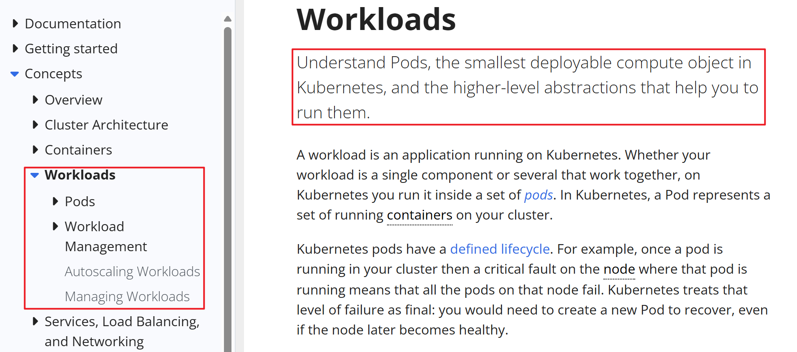
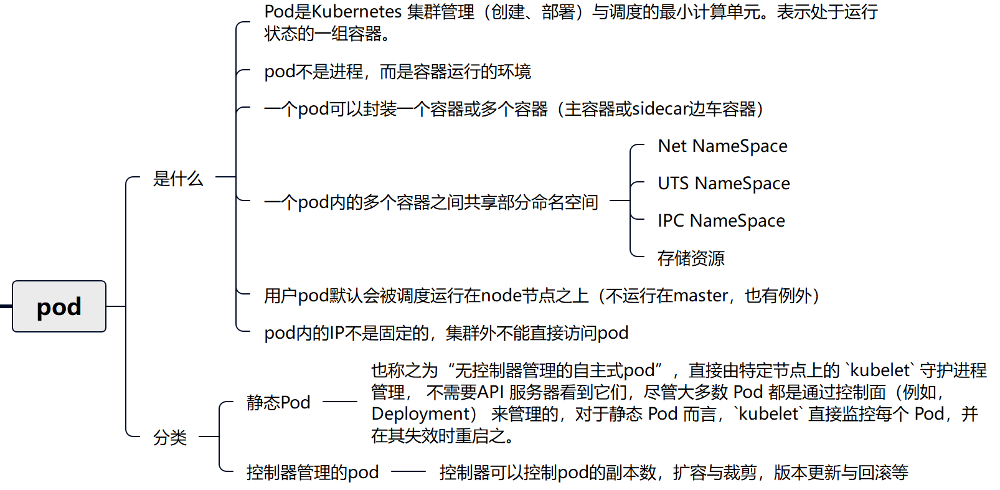

# Kubernetes集群核心概念 Pod

## 工作负载(workloads)

参考链接：[工作负载 | Kubernetes](https://kubernetes.io/zh-cn/docs/concepts/workloads/)

工作负载（workload）是在kubernetes集群中运行的应用程序。无论你的工作负载是单一服务还是多个一同工作的服务构成，在kubernetes中都可以使用pod来运行它。



workloads分为pod与controllers

- pod通过控制器实现应用的运行，如何伸缩，升级等
- controllers 在集群中管理pod
- pod与控制器之间通过label-selector相关联，是唯一的关联方式

在pod的YAML里指定pod标签

```shell
# 定义标签
  labels: 
	app: nginx
```


在控制器的YAML里指定标签选择器匹配标签

```shell
# 通过标签选择器选择对应的pod
  selector:
    matchLabels:
      app: nginx
```

## pod介绍

参考链接: [Pod | Kubernetes](https://kubernetes.io/zh-cn/docs/concepts/workloads/pods/)



### 查看pod方法

pod是一种计算资源，可以通过`kubectl get pod`来查看

```shell
[root@k8s-master01 ~]# kubectl get pod		# pod或pods都可以，不指定namespace,默认是名为default的namespace
No resources found in default namespace.
[root@k8s-master01 ~]# kubectl get pod -n kube-system
NAME                                   READY   STATUS    RESTARTS       AGE
coredns-5dd5756b68-gbgsh               1/1     Running   13 (17h ago)   4d4h
coredns-5dd5756b68-pm85d               1/1     Running   13 (17h ago)   4d4h
etcd-k8s-master01                      1/1     Running   13 (17h ago)   4d4h
kube-apiserver-k8s-master01            1/1     Running   14 (17h ago)   4d4h
kube-controller-manager-k8s-master01   1/1     Running   13 (17h ago)   4d4h
kube-proxy-h7s9b                       1/1     Running   7 (17h ago)    3d20h
kube-proxy-qt8px                       1/1     Running   7 (17h ago)    3d20h
kube-proxy-wlvrg                       1/1     Running   7 (17h ago)    3d20h
kube-scheduler-k8s-master01            1/1     Running   13 (17h ago)   4d4h
metrics-server-596474b58-697f8         1/1     Running   1 (17h ago)    19h
[root@k8s-master01 ~]#
```

### pod的YAML资源清单格式

YAML格式查找帮助方法

```shell
[root@k8s-master01 ~]# kubectl explain namespace

[root@k8s-master01 ~]# kubectl explain pod
[root@k8s-master01 ~]# kubectl explain pod.spec
[root@k8s-master01 ~]# kubectl explain pod.spec.containers
```

样例，及供参考。

```shell
# yaml格式的pod定义文件完整内容：
apiVersion: v1       #必选，api版本号，例如v1
kind: Pod       	#必选，Pod
metadata:       	#必选，元数据
  name: string       #必选，Pod名称
  namespace: string    #Pod所属的命名空间,默认在default的namespace
  labels:     		 # 自定义标签
    name: string     #自定义标签名字
  annotations:        #自定义注释列表
    name: string
spec:         #必选，Pod中容器的详细定义(期望)
  containers:      #必选，Pod中容器列表
  - name: string     #必选，容器名称
    image: string    #必选，容器的镜像名称
    imagePullPolicy: [Always | Never | IfNotPresent] #获取镜像的策略 Alawys表示下载镜像 IfnotPresent表示优先使用本地镜像，否则下载镜像，Nerver表示仅使用本地镜像
    command: [string]    #容器的启动命令列表，如不指定，使用打包时使用的启动命令
    args: [string]     #容器的启动命令参数列表
    workingDir: string     #容器的工作目录
    volumeMounts:    #挂载到容器内部的存储卷配置
    - name: string     #引用pod定义的共享存储卷的名称，需用volumes[]部分定义的的卷名
      mountPath: string    #存储卷在容器内mount的绝对路径，应少于512字符
      readOnly: boolean    #是否为只读模式
    ports:       #需要暴露的端口库号列表
    - name: string     #端口号名称
      containerPort: int   #容器需要监听的端口号
      hostPort: int    #容器所在主机需要监听的端口号，默认与Container相同
      protocol: string     #端口协议，支持TCP和UDP，默认TCP
    env:       #容器运行前需设置的环境变量列表
    - name: string     #环境变量名称
      value: string    #环境变量的值
    resources:       #资源限制和请求的设置
      limits:      #资源限制的设置
        cpu: string    #Cpu的限制，单位为core数，将用于docker run --cpu-shares参数
        memory: string     #内存限制，单位可以为Mib/Gib，将用于docker run --memory参数
      requests:      #资源请求的设置
        cpu: string    #Cpu请求，容器启动的初始可用数量
        memory: string     #内存清求，容器启动的初始可用数量
    livenessProbe:     #对Pod内个容器健康检查的设置，当探测无响应几次后将自动重启该容器，检查方法有exec、httpGet和tcpSocket，对一个容器只需设置其中一种方法即可
      exec:      #对Pod容器内检查方式设置为exec方式
        command: [string]  #exec方式需要制定的命令或脚本
      httpGet:       #对Pod内个容器健康检查方法设置为HttpGet，需要制定Path、port
        path: string
        port: number
        host: string
        scheme: string
        HttpHeaders:
        - name: string
          value: string
      tcpSocket:     #对Pod内个容器健康检查方式设置为tcpSocket方式
         port: number
       initialDelaySeconds: 0  #容器启动完成后首次探测的时间，单位为秒
       timeoutSeconds: 0   #对容器健康检查探测等待响应的超时时间，单位秒，默认1秒
       periodSeconds: 0    #对容器监控检查的定期探测时间设置，单位秒，默认10秒一次
       successThreshold: 0
       failureThreshold: 0
       securityContext:
         privileged:false
    restartPolicy: [Always | Never | OnFailure] # Pod的重启策略，Always表示一旦不管以何种方式终止运行，kubelet都将重启，OnFailure表示只有Pod以非0退出码退出才重启，Nerver表示不再重启该Pod
    nodeSelector: obeject  # 设置NodeSelector表示将该Pod调度到包含这个label的node上，以key：value的格式指定
    imagePullSecrets:    #Pull镜像时使用的secret名称，以key：secretkey格式指定
    - name: string
    hostNetwork: false     #是否使用主机网络模式，默认为false，如果设置为true，表示使用宿主机网络
    volumes:       #在该pod上定义共享存储卷列表
    - name: string     #共享存储卷名称 （volumes类型有很多种）
      emptyDir: {}     #类型为emtyDir的存储卷，与Pod同生命周期的一个临时目录。为空值
      hostPath: string     #类型为hostPath的存储卷，表示挂载Pod所在宿主机的目录
        path: string     #Pod所在宿主机的目录，将被用于同期中mount的目录
      secret:      #类型为secret的存储卷，挂载集群与定义的secret对象到容器内部
        scretname: string  
        items:     
        - key: string
          path: string
      configMap:     #类型为configMap的存储卷，挂载预定义的configMap对象到容器内部
        name: string
        items:
        - key: string
          path: string
```


## pod创建与验证

### 命令创建pod(v1.18变化)

- k8s之前版本中, kubectl run命令用于创建deployment控制器
- 在v1.18版本中, kubectl run命令改为创建pod

### 创建一个名为pod-nginx的pod

```shell
[root@k8s-master01 ~]# kubectl run nginx1 --image=nginx
pod/nginx1 created
```

### 验证

```shell
[root@k8s-master01 ~]# kubectl get pods
NAME             READY   STATUS    RESTARTS   AGE
nginx1           1/1     Running   0          41s

# NAME：Pod 的名称。名称在同一命名空间内必须唯一。
# READY：Pod 中容器的就绪状态。格式为 就绪容器数量/总容器数量。
# STATUS：Pod 的当前状态。
#     常见的状态包括：
#     Running：Pod 中的所有容器已成功启动并正在运行。
#     Pending：Pod 已被调度到节点，但容器尚未启动（例如，正在拉取镜像）。
#     Succeeded：Pod 中的所有容器已成功完成任务并退出。
#     Failed：Pod 中的至少一个容器因错误退出。
#     CrashLoopBackOff：容器启动失败，Kubernetes 正在重试。
#     Unknown：无法获取 Pod 的状态（通常是由于与节点通信失败）。
# RESTARTS：Pod 中容器的重启次数。
# AGE：Pod 的存活时间。从 Pod 创建到当前时间的时间间隔。时间单位可以是秒（s）、分钟（m）、小时（h）或天（d）。
```

