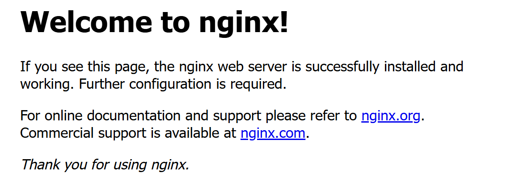

## nginx 安装

常用版本4大阵营

- Nginx开源版本：[nginx](https://nginx.org/)
- Nginx plus 商业版：[Welcome to F5 NGINX](https://www.f5.com/go/product/welcome-to-nginx)
- openresty：[OpenResty® - 开源官方站](https://openresty.org/cn/)
- Tengine：[The Tengine Web Server](https://tengine.taobao.org/)


安装参考链接：[nginx：Linux 软件包](https://nginx.org/en/linux_packages.html#Debian)

```shell
# 前提条件
sudo apt install curl gnupg2 ca-certificates lsb-release debian-archive-keyring

# 导入官方 nginx 签名密钥
curl https://nginx.org/keys/nginx_signing.key | gpg --dearmor \
    | sudo tee /usr/share/keyrings/nginx-archive-keyring.gpg >/dev/null
    
# 验证下载的文件是否包含正确的密钥
root@debian:~# gpg --dry-run --quiet --no-keyring --import --import-options import-show /usr/share/keyrings/nginx-archive-keyring.gpg
pub   rsa4096 2024-05-29 [SC]
      8540A6F18833A80E9C1653A42FD21310B49F6B46
uid                      nginx signing key <signing-key-2@nginx.com>

pub   rsa2048 2011-08-19 [SC] [expires: 2027-05-24]
      573BFD6B3D8FBC641079A6ABABF5BD827BD9BF62
uid                      nginx signing key <signing-key@nginx.com>

pub   rsa4096 2024-05-29 [SC]
      9E9BE90EACBCDE69FE9B204CBCDCD8A38D88A2B3
uid                      nginx signing key <signing-key-3@nginx.com>

# 为稳定的 nginx 软件包设置 apt 存储库
echo "deb [signed-by=/usr/share/keyrings/nginx-archive-keyring.gpg] \
http://nginx.org/packages/debian `lsb_release -cs` nginx" \
    | sudo tee /etc/apt/sources.list.d/nginx.list

# 安装 nginx
sudo apt update
sudo apt install nginx
```

## nginx 启动及验证

```shell
# 启动
root@debian:~# /usr/sbin/nginx
root@debian:~# ps -ef|grep nginx | grep -v grep
root        6683       1  0 19:54 ?        00:00:00 nginx: master process /usr/sbin/nginx
nginx       6684    6683  0 19:54 ?        00:00:00 nginx: worker process
nginx       6685    6683  0 19:54 ?        00:00:00 nginx: worker process
nginx       6686    6683  0 19:54 ?        00:00:00 nginx: worker process
nginx       6687    6683  0 19:54 ?        00:00:00 nginx: worker process
```


- vmware 上配置本地端口到虚机端口的映射
- 虚机上如果有防火墙，注意防火墙的配置



### 配置启动服务

```shell
# 查看/lib/systemd/system/nginx.service 或 /usr/lib/systemd/system/nginx.service 文件是否存在
# 注意安装路径的修改

[Unit]
Description=nginx - high performance web server
Documentation=https://nginx.org/en/docs/
After=network-online.target remote-fs.target nss-lookup.target
Wants=network-online.target

[Service]
Type=forking
PIDFile=/run/nginx.pid
Environment="CONFFILE=/etc/nginx/nginx.conf"
EnvironmentFile=-/etc/default/nginx
ExecStart=/usr/sbin/nginx -c ${CONFFILE}
ExecReload=/bin/sh -c "/bin/kill -s HUP $(/bin/cat /run/nginx.pid)"
ExecStop=/bin/sh -c "/bin/kill -s TERM $(/bin/cat /run/nginx.pid)"
ExecQuit=/bin/sh -c "/bin/kill -s QUIT $(/bin/cat /run/nginx.pid)"

[Install]
WantedBy=multi-user.target

# 查看服务是否可用，开机自启动
systemctl daemon-reload
systemctl status nginx
systemctl enable nginx
```


## nginx 常用命令

```shell
# 查看版本
root@debian:~# nginx -v
nginx version: nginx/1.28.0

# 停止命令
root@debian:~# nginx -s stop
root@debian:~# ps -ef|grep nginx | grep -v grep

# 启动命令
root@debian:~# /usr/sbin/nginx
root@debian:~# ps -ef|grep nginx | grep -v grep
root        6797       1  0 20:21 ?        00:00:00 nginx: master process /usr/sbin/nginx
nginx       6798    6797  0 20:21 ?        00:00:00 nginx: worker process
nginx       6799    6797  0 20:21 ?        00:00:00 nginx: worker process
nginx       6800    6797  0 20:21 ?        00:00:00 nginx: worker process
nginx       6801    6797  0 20:21 ?        00:00:00 nginx: worker process

# 配置重新加载
root@debian:~# /usr/sbin/nginx -s reload
root@debian:~# ps -ef|grep nginx | grep -v grep
root        6797       1  0 20:21 ?        00:00:00 nginx: master process /usr/sbin/nginx
nginx       6809    6797  0 20:23 ?        00:00:00 nginx: worker process
nginx       6810    6797  0 20:23 ?        00:00:00 nginx: worker process
nginx       6811    6797  0 20:23 ?        00:00:00 nginx: worker process
nginx       6812    6797  0 20:23 ?        00:00:00 nginx: worker process

# 配置默认路径
root@debian:~# ls -l /etc/nginx/
total 28
drwxr-xr-x 2 root root 4096 May 17 19:39 conf.d
-rw-r--r-- 1 root root 1007 Apr 23 07:48 fastcgi_params
-rw-r--r-- 1 root root 5349 Apr 23 07:48 mime.types
lrwxrwxrwx 1 root root   22 Apr 23 08:39 modules -> /usr/lib/nginx/modules
-rw-r--r-- 1 root root  644 Apr 23 08:39 nginx.conf
-rw-r--r-- 1 root root  636 Apr 23 07:48 scgi_params
-rw-r--r-- 1 root root  664 Apr 23 07:48 uwsgi_params
```

### 停止nginx的其他方式

参考链接：[Beginner’s Guide](https://nginx.org/en/docs/beginners_guide.html)

```shell
# to stop nginx processes with waiting for the worker processes to finish serving current requests
nginx -s quit

# 通过 kill 命令
[ -f /var/run/nginx.pid ] && cat /var/run/nginx.pid | xargs kill -s QUIT

# 查看nginx资源使用情况
ps axw -o pid,ppid,user,%cpu,vsz,wchan,command | egrep '(nginx|PID)'
```

## 配置文件

指令种类：简单指令，块指令。

全局块：就是最开始的简单指令。从配置文件开始到events

```shell
user  nginx;
worker_processes  auto;

error_log  /var/log/nginx/error.log notice;
pid        /run/nginx.pid;
```

events块：配置服务器和用户网络连接相关的参数。

http块：配置代理、缓存、日志及第三方模块等。

### 最小化配置文件

```shell
# cat /etc/nginx/nginx.conf

user  nginx;                                   # worker进程启动时以哪个用户启动，限制 worker 进程的权限，提高安全性。
worker_processes  auto;                        # 启动nginx时，启动多少个worker进程，设置为 CPU 核心数或 2 倍 CPU 核心数。

error_log  /var/log/nginx/error.log notice;    # 指定错误日志的路径和日志级别。notice 表示记录 notice 级别及以上的日志（如 notice、warn、error）。
pid        /run/nginx.pid;                     # 指定存储 Nginx 主进程 PID 的文件路径。


events {
    worker_connections  1024;                  # 设置每个 worker 进程的最大连接数。总并发连接数 = worker_processes × worker_connections。
}


http {
    include       /etc/nginx/mime.types;       # 包含MIME类型配置文件
    default_type  application/octet-stream;    # 默认的MIME类型

    log_format  main  '$remote_addr - $remote_user [$time_local] "$request" '
                      '$status $body_bytes_sent "$http_referer" '
                      '"$http_user_agent" "$http_x_forwarded_for"';    # 定义日志格式。main 是日志格式的名称，后面是具体的格式字符串。

    access_log  /var/log/nginx/access.log  main;  # 指定访问日志的路径和日志格式。

    sendfile        on;   # 启用 sendfile 机制，直接通过内核发送文件，减少用户态和内核态之间的数据拷贝。
    #tcp_nopush     on;   # 启用 TCP_NOPUSH 选项，确保数据包填满后再发送

    keepalive_timeout  65;   # 设置客户端保持连接的超时时间（单位为秒）。

    #gzip  on;               # 启用 gzip 压缩

    include /etc/nginx/conf.d/*.conf;
}
```


```shell
# /etc/nginx/conf.d/default.conf

# server 块可以是多个
server {
    listen       80;         # 指定 Nginx 监听的端口号。
    server_name  localhost;  # 指定服务器的域名或主机名。

    #access_log  /var/log/nginx/host.access.log  main;

    # location 块可以是多个
    location / {    # 定义根路径（/）的请求处理规则。
        root   /usr/share/nginx/html;   # 指定根路径的静态文件存储目录。
        index  index.html index.htm;    # 指定默认的索引文件。
    }

    #error_page  404              /404.html;

    # redirect server error pages to the static page /50x.html
    #
    error_page   500 502 503 504  /50x.html;   # 定义当服务器返回 500、502、503 或 504 错误时，重定向到 /50x.html 页面。
    location = /50x.html {              # 定义 /50x.html 路径的请求处理规则。= 表示精确匹配。
        root   /usr/share/nginx/html;   # 指定 /50x.html 文件的存储目录。
    }

    # proxy the PHP scripts to Apache listening on 127.0.0.1:80
    #
    #location ~ \.php$ {                 # 匹配所有以 .php 结尾的请求路径。~ 表示正则表达式匹配。
    #    proxy_pass   http://127.0.0.1;  # 将 PHP 请求代理到 http://127.0.0.1（通常是 Apache 服务器）。
    #}

    # pass the PHP scripts to FastCGI server listening on 127.0.0.1:9000
    #
    #location ~ \.php$ {                 # 匹配所有以 .php 结尾的请求路径。~ 表示正则表达式匹配。
    #    root           html;            # 指定根路径的静态文件存储目录。
    #    fastcgi_pass   127.0.0.1:9000;  # 将 PHP 请求转发给 FastCGI 服务器（如 PHP-FPM）处理。
    #    fastcgi_index  index.php;       # 指定FastCGI 服务器默认的索引文件。
    #    fastcgi_param  SCRIPT_FILENAME  /scripts$fastcgi_script_name;  # 设置 FastCGI 参数，指定 PHP 脚本的路径。
    #    include        fastcgi_params;  # 包含 FastCGI 的默认参数配置文件。
    #}

    # deny access to .htaccess files, if Apache's document root
    # concurs with nginx's one
    #
    #location ~ /\.ht {  # 匹配所有以 .ht 开头的文件路径（如 .htaccess）。
    #    deny  all;      # 禁止访问匹配的文件。
    #}
}
```

## 反向代理

### 单台代理

#### 目标

- 在浏览器访问一个地址: http://127.0.0.1:3000/。
- Nginx接受上面的请求。
- 转发请求到tomcat。
- tomcat响应一个页面，页面中有："tomcat hello !!!"。

#### 操作步骤1：安装tomcat

```shell
# 安装java
sudo apt install openjdk-17-jdk

# 安装tomcat
root@debian:~# wget https://dlcdn.apache.org/tomcat/tomcat-11/v11.0.7/bin/apache-tomcat-11.0.7.tar.gz
root@debian:~# sudo tar -xzf apache-tomcat-11.0.7.tar.gz -C /opt
root@debian:~# sudo mv /opt/apache-tomcat-11.0.7/ /opt/tomcat

# 配置环境变量
root@debian:/opt/tomcat# vim /etc/profile
if [ -d /opt/tomcat ]; then
    export CATALINA_HOME=/opt/tomcat
    export PATH=$PATH:$CATALINA_HOME/bin
fi

# 创建tomcat用户
root@debian:/opt/tomcat# sudo useradd -r -m -U -d /opt/tomcat -s /bin/false tomcat
useradd: warning: the home directory /opt/tomcat already exists.
useradd: Not copying any file from skel directory into it.
root@debian:/opt/tomcat#
root@debian:/opt/tomcat# sudo chown -R tomcat: /opt/tomcat

# 配置tomcat服务
root@debian:/opt/tomcat# vim /etc/systemd/system/tomcat.service
[Unit]
Description=Apache Tomcat Web Application Container
After=network.target

[Service]
Type=forking

User=tomcat
Group=tomcat

Environment="JAVA_HOME=/usr/lib/jvm/java-17-openjdk-amd64"
Environment="CATALINA_PID=/opt/tomcat/temp/tomcat.pid"
Environment="CATALINA_HOME=/opt/tomcat"
Environment="CATALINA_BASE=/opt/tomcat"

ExecStart=/opt/tomcat/bin/startup.sh
ExecStop=/opt/tomcat/bin/shutdown.sh

RestartSec=10
Restart=always

[Install]
WantedBy=multi-user.target

# 生成目标页面
root@debian:~ # cd /opt/tomcat/webapps/ROOT
root@debian:/opt/tomcat/webapps/ROOT# vim index.html
tomcat hello !!!

# 启动服务
root@debian:/opt/tomcat# sudo systemctl daemon-reload
root@debian:/opt/tomcat# sudo systemctl start tomcat
root@debian:/opt/tomcat# sudo systemctl status tomcat
● tomcat.service - Apache Tomcat Web Application Container
     Loaded: loaded (/etc/systemd/system/tomcat.service; disabled; preset: enabled)
     Active: active (running) since Mon 2025-05-19 09:36:27 EDT; 5s ago
    Process: 2271 ExecStart=/opt/tomcat/bin/startup.sh (code=exited, status=0/SUCCESS)
   Main PID: 2278 (java)
      Tasks: 38 (limit: 2241)
     Memory: 80.5M
        CPU: 2.304s
     CGroup: /system.slice/tomcat.service
             └─2278 /usr/lib/jvm/java-17-openjdk-amd64/bin/java -Djava.util.logging.config.file=/opt/tomcat/conf/logging.properties -Djava.util.logging.m>

May 19 09:36:27 debian systemd[1]: Starting tomcat.service - Apache Tomcat Web Application Container...
May 19 09:36:27 debian startup.sh[2271]: Tomcat started.
May 19 09:36:27 debian systemd[1]: Started tomcat.service - Apache Tomcat Web Application Container.

# 本地验证
root@debian:/opt/tomcat/webapps/ROOT# curl localhost:8080/index.html
tomcat hello !!!
```

#### 操作步骤2：nginx配置

```shell
# 配置nginx代理地址:端口
root@debian:/opt/tomcat/webapps/ROOT# cd /etc/nginx/conf.d/
root@debian:/etc/nginx/conf.d# vim default.conf
    location / {
            #        root   /usr/share/nginx/html;
            #        index  index.html index.htm;
        proxy_pass   http://127.0.0.1:8080;
    }

# 重新加载nginx配置
root@debian:/etc/nginx/conf.d# /usr/sbin/nginx -s reload

```

#### 操作步骤3：本地验证

```shell
C:\Users\YY>curl http://127.0.0.1:3000
tomcat hello !!!
```


### 多台代理

#### 目标

- 浏览器访问：（http://127.0.0.0:3000/beijing），通过nginx，跳转到一个tomcat上 （http://localhost:8081），在浏览器上显示：beijing。
- 浏览器访问：（http://127.0.0.0:3000/shanghai），通过nginx，跳转到一个tomcat上（http://localhost:8082），在浏览器上显示：shanghai

#### 操作步骤1：安装tomcat

```shell
# 在单台代理的基础上，拷贝两个tomcat，再配置两个tomcat
root@debian:/opt/tomcat8081/conf# vim server.xml
<Server port="8015" shutdown="SHUTDOWN">

    <Connector port="8081" protocol="HTTP/1.1"
               connectionTimeout="20000"
               redirectPort="8443" />
               
root@debian:/opt/tomcat8082/conf# vim server.xml
<Server port="8025" shutdown="SHUTDOWN">

    <Connector port="8082" protocol="HTTP/1.1"
               connectionTimeout="20000"
               redirectPort="8453" />
              
# 停止tomcat
root@debian:/opt/tomcat8082/conf# systemctl stop tomcat
root@debian:/opt/tomcat8082/conf# systemctl status tomcat
○ tomcat.service - Apache Tomcat Web Application Container
     Loaded: loaded (/etc/systemd/system/tomcat.service; disabled; preset: enabled)
     Active: inactive (dead)

# 修改html文件内容
root@debian:/opt/tomcat8081/webapps/beijing # vim index.html
beijing

root@debian:/opt/tomcat8082/webapps/shanghai # vim index.html
shanghai

# 启动服务并验证
export CATALINA_HOME=/opt/tomcat8081
export PATH=$CATALINA_HOME/bin:$PATH
root@debian:/opt/tomcat8081# ./bin/startup.sh
root@debian:/opt/tomcat8081# curl http://localhost:8081
beijing

export CATALINA_HOME=/opt/tomcat8082
export PATH=$CATALINA_HOME/bin:$PATH
root@debian:/opt/tomcat8082# ./bin/startup.sh
root@debian:/opt/tomcat8082# curl http://localhost:8082
shanghai
```

#### 操作步骤2：nginx配置

```shell
# 配置nginx代理地址:端口
root@debian:/opt/tomcat/webapps/ROOT# cd /etc/nginx/conf.d/
root@debian:/etc/nginx/conf.d# vim default.conf
    location ~ /beijing/ {
        proxy_pass   http://127.0.0.1:8081;
    }
    location ~ /shanghai/ {
        proxy_pass   http://127.0.0.1:8082;
    }

    location / {
            #        root   /usr/share/nginx/html;
            #        index  index.html index.htm;
        proxy_pass   http://127.0.0.1:8080;
    }

# 重新加载nginx配置
root@debian:/etc/nginx/conf.d# /usr/sbin/nginx -s reload

```

#### 操作步骤3：本地验证

```shell
C:\Users\YY>curl http://127.0.0.1:3000/shanghai/
shanghai

C:\Users\YY>curl http://127.0.0.1:3000/shanghai/index.html
shanghai

C:\Users\YY>curl http://127.0.0.1:3000/beijing/index.html
beijing

C:\Users\YY>curl http://127.0.0.1:3000/beijing/
beijing
```


