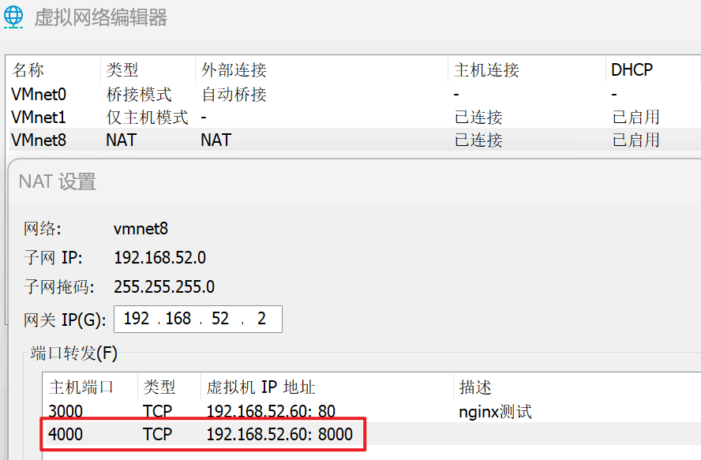
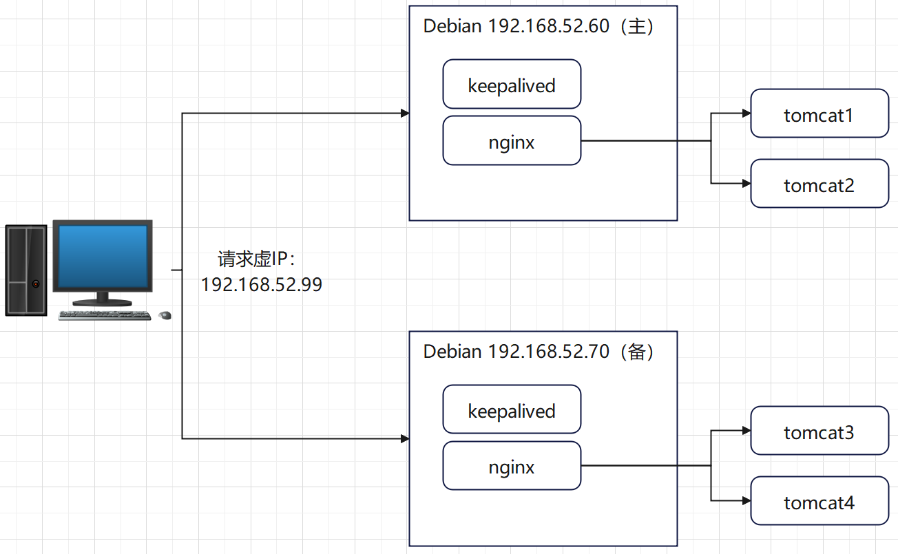

## nginx 安装

常用版本4大阵营

- Nginx开源版本：[nginx](https://nginx.org/)
- Nginx plus 商业版：[Welcome to F5 NGINX](https://www.f5.com/go/product/welcome-to-nginx)
- openresty：[OpenResty® - 开源官方站](https://openresty.org/cn/)
- Tengine：[The Tengine Web Server](https://tengine.taobao.org/)


安装参考链接：[nginx：Linux 软件包](https://nginx.org/en/linux_packages.html#Debian)

```shell
# 前提条件
sudo apt install curl gnupg2 ca-certificates lsb-release debian-archive-keyring

# 导入官方 nginx 签名密钥
curl https://nginx.org/keys/nginx_signing.key | gpg --dearmor \
    | sudo tee /usr/share/keyrings/nginx-archive-keyring.gpg >/dev/null
    
# 验证下载的文件是否包含正确的密钥
root@debian:~# gpg --dry-run --quiet --no-keyring --import --import-options import-show /usr/share/keyrings/nginx-archive-keyring.gpg
pub   rsa4096 2024-05-29 [SC]
      8540A6F18833A80E9C1653A42FD21310B49F6B46
uid                      nginx signing key <signing-key-2@nginx.com>

pub   rsa2048 2011-08-19 [SC] [expires: 2027-05-24]
      573BFD6B3D8FBC641079A6ABABF5BD827BD9BF62
uid                      nginx signing key <signing-key@nginx.com>

pub   rsa4096 2024-05-29 [SC]
      9E9BE90EACBCDE69FE9B204CBCDCD8A38D88A2B3
uid                      nginx signing key <signing-key-3@nginx.com>

# 为稳定的 nginx 软件包设置 apt 存储库
echo "deb [signed-by=/usr/share/keyrings/nginx-archive-keyring.gpg] \
http://nginx.org/packages/debian `lsb_release -cs` nginx" \
    | sudo tee /etc/apt/sources.list.d/nginx.list

# 安装 nginx
sudo apt update
sudo apt install nginx
```

## nginx 启动及验证

```shell
# 启动
root@debian:~# /usr/sbin/nginx
root@debian:~# ps -ef|grep nginx | grep -v grep
root        6683       1  0 19:54 ?        00:00:00 nginx: master process /usr/sbin/nginx
nginx       6684    6683  0 19:54 ?        00:00:00 nginx: worker process
nginx       6685    6683  0 19:54 ?        00:00:00 nginx: worker process
nginx       6686    6683  0 19:54 ?        00:00:00 nginx: worker process
nginx       6687    6683  0 19:54 ?        00:00:00 nginx: worker process
```


- vmware 上配置本地端口到虚机端口的映射
- 虚机上如果有防火墙，注意防火墙的配置


### 配置启动服务

```shell
# 查看/lib/systemd/system/nginx.service 或 /usr/lib/systemd/system/nginx.service 文件是否存在
# 注意安装路径的修改

[Unit]
Description=nginx - high performance web server
Documentation=https://nginx.org/en/docs/
After=network-online.target remote-fs.target nss-lookup.target
Wants=network-online.target

[Service]
Type=forking
PIDFile=/run/nginx.pid
Environment="CONFFILE=/etc/nginx/nginx.conf"
EnvironmentFile=-/etc/default/nginx
ExecStart=/usr/sbin/nginx -c ${CONFFILE}
ExecReload=/bin/sh -c "/bin/kill -s HUP $(/bin/cat /run/nginx.pid)"
ExecStop=/bin/sh -c "/bin/kill -s TERM $(/bin/cat /run/nginx.pid)"
ExecQuit=/bin/sh -c "/bin/kill -s QUIT $(/bin/cat /run/nginx.pid)"

[Install]
WantedBy=multi-user.target

# 查看服务是否可用，开机自启动
systemctl daemon-reload
systemctl status nginx
systemctl enable nginx
```


## nginx 常用命令

```shell
# 查看版本
root@debian:~# nginx -v
nginx version: nginx/1.28.0

# 停止命令
root@debian:~# nginx -s stop
root@debian:~# ps -ef|grep nginx | grep -v grep

# 启动命令
root@debian:~# /usr/sbin/nginx
root@debian:~# ps -ef|grep nginx | grep -v grep
root        6797       1  0 20:21 ?        00:00:00 nginx: master process /usr/sbin/nginx
nginx       6798    6797  0 20:21 ?        00:00:00 nginx: worker process
nginx       6799    6797  0 20:21 ?        00:00:00 nginx: worker process
nginx       6800    6797  0 20:21 ?        00:00:00 nginx: worker process
nginx       6801    6797  0 20:21 ?        00:00:00 nginx: worker process

# 配置重新加载
root@debian:~# /usr/sbin/nginx -s reload
root@debian:~# ps -ef|grep nginx | grep -v grep
root        6797       1  0 20:21 ?        00:00:00 nginx: master process /usr/sbin/nginx
nginx       6809    6797  0 20:23 ?        00:00:00 nginx: worker process
nginx       6810    6797  0 20:23 ?        00:00:00 nginx: worker process
nginx       6811    6797  0 20:23 ?        00:00:00 nginx: worker process
nginx       6812    6797  0 20:23 ?        00:00:00 nginx: worker process

# 配置默认路径
root@debian:~# ls -l /etc/nginx/
total 28
drwxr-xr-x 2 root root 4096 May 17 19:39 conf.d
-rw-r--r-- 1 root root 1007 Apr 23 07:48 fastcgi_params
-rw-r--r-- 1 root root 5349 Apr 23 07:48 mime.types
lrwxrwxrwx 1 root root   22 Apr 23 08:39 modules -> /usr/lib/nginx/modules
-rw-r--r-- 1 root root  644 Apr 23 08:39 nginx.conf
-rw-r--r-- 1 root root  636 Apr 23 07:48 scgi_params
-rw-r--r-- 1 root root  664 Apr 23 07:48 uwsgi_params
```

### 停止nginx的其他方式

参考链接：[Beginner’s Guide](https://nginx.org/en/docs/beginners_guide.html)

```shell
# to stop nginx processes with waiting for the worker processes to finish serving current requests
nginx -s quit

# 通过 kill 命令
[ -f /var/run/nginx.pid ] && cat /var/run/nginx.pid | xargs kill -s QUIT

# 查看nginx资源使用情况
ps axw -o pid,ppid,user,%cpu,vsz,wchan,command | egrep '(nginx|PID)'
```

## 配置文件

指令种类：简单指令，块指令。

全局块：就是最开始的简单指令。从配置文件开始到events

```shell
user  nginx;
worker_processes  auto;

error_log  /var/log/nginx/error.log notice;
pid        /run/nginx.pid;
```

events块：配置服务器和用户网络连接相关的参数。

http块：配置代理、缓存、日志及第三方模块等。

### 最小化配置文件

```shell
# cat /etc/nginx/nginx.conf

user  nginx;                                   # worker进程启动时以哪个用户启动，限制 worker 进程的权限，提高安全性。
worker_processes  auto;                        # 启动nginx时，启动多少个worker进程，设置为 CPU 核心数或 2 倍 CPU 核心数。

error_log  /var/log/nginx/error.log notice;    # 指定错误日志的路径和日志级别。notice 表示记录 notice 级别及以上的日志（如 notice、warn、error）。
pid        /run/nginx.pid;                     # 指定存储 Nginx 主进程 PID 的文件路径。


events {
    worker_connections  1024;                  # 设置每个 worker 进程的最大连接数。总并发连接数 = worker_processes × worker_connections。
}


http {
    include       /etc/nginx/mime.types;       # 包含MIME类型配置文件
    default_type  application/octet-stream;    # 默认的MIME类型

    log_format  main  '$remote_addr - $remote_user [$time_local] "$request" '
                      '$status $body_bytes_sent "$http_referer" '
                      '"$http_user_agent" "$http_x_forwarded_for"';    # 定义日志格式。main 是日志格式的名称，后面是具体的格式字符串。

    access_log  /var/log/nginx/access.log  main;  # 指定访问日志的路径和日志格式。

    sendfile        on;   # 启用 sendfile 机制，直接通过内核发送文件，减少用户态和内核态之间的数据拷贝。
    #tcp_nopush     on;   # 启用 TCP_NOPUSH 选项，确保数据包填满后再发送

    keepalive_timeout  65;   # 设置客户端保持连接的超时时间（单位为秒）。

    #gzip  on;               # 启用 gzip 压缩

    include /etc/nginx/conf.d/*.conf;
}
```


```shell
# /etc/nginx/conf.d/default.conf

# server 块可以是多个
server {
    listen       80;         # 指定 Nginx 监听的端口号。
    server_name  localhost;  # 指定服务器的域名或主机名。

    #access_log  /var/log/nginx/host.access.log  main;

    # location 块可以是多个
    location / {    # 定义根路径（/）的请求处理规则。
        root   /usr/share/nginx/html;   # 指定根路径的静态文件存储目录。
        index  index.html index.htm;    # 指定默认的索引文件。
    }

    #error_page  404              /404.html;

    # redirect server error pages to the static page /50x.html
    #
    error_page   500 502 503 504  /50x.html;   # 定义当服务器返回 500、502、503 或 504 错误时，重定向到 /50x.html 页面。
    location = /50x.html {              # 定义 /50x.html 路径的请求处理规则。= 表示精确匹配。
        root   /usr/share/nginx/html;   # 指定 /50x.html 文件的存储目录。
    }

    # proxy the PHP scripts to Apache listening on 127.0.0.1:80
    #
    #location ~ \.php$ {                 # 匹配所有以 .php 结尾的请求路径。~ 表示正则表达式匹配。
    #    proxy_pass   http://127.0.0.1;  # 将 PHP 请求代理到 http://127.0.0.1（通常是 Apache 服务器）。
    #}

    # pass the PHP scripts to FastCGI server listening on 127.0.0.1:9000
    #
    #location ~ \.php$ {                 # 匹配所有以 .php 结尾的请求路径。~ 表示正则表达式匹配。
    #    root           html;            # 指定根路径的静态文件存储目录。
    #    fastcgi_pass   127.0.0.1:9000;  # 将 PHP 请求转发给 FastCGI 服务器（如 PHP-FPM）处理。
    #    fastcgi_index  index.php;       # 指定FastCGI 服务器默认的索引文件。
    #    fastcgi_param  SCRIPT_FILENAME  /scripts$fastcgi_script_name;  # 设置 FastCGI 参数，指定 PHP 脚本的路径。
    #    include        fastcgi_params;  # 包含 FastCGI 的默认参数配置文件。
    #}

    # deny access to .htaccess files, if Apache's document root
    # concurs with nginx's one
    #
    #location ~ /\.ht {  # 匹配所有以 .ht 开头的文件路径（如 .htaccess）。
    #    deny  all;      # 禁止访问匹配的文件。
    #}
}
```

## 反向代理

### 单台代理

#### 目标

- 在浏览器访问一个地址: http://127.0.0.1:3000/。
- Nginx接受上面的请求。
- 转发请求到tomcat。
- tomcat响应一个页面，页面中有："tomcat hello !!!"。

#### 操作步骤1：安装tomcat

```shell
# 安装java
sudo apt install openjdk-17-jdk

# 安装tomcat
root@debian:~# wget https://dlcdn.apache.org/tomcat/tomcat-11/v11.0.7/bin/apache-tomcat-11.0.7.tar.gz
root@debian:~# sudo tar -xzf apache-tomcat-11.0.7.tar.gz -C /opt
root@debian:~# sudo mv /opt/apache-tomcat-11.0.7/ /opt/tomcat

# 配置环境变量
root@debian:/opt/tomcat# vim /etc/profile
if [ -d /opt/tomcat ]; then
    export CATALINA_HOME=/opt/tomcat
    export PATH=$PATH:$CATALINA_HOME/bin
fi

# 创建tomcat用户
root@debian:/opt/tomcat# sudo useradd -r -m -U -d /opt/tomcat -s /bin/false tomcat
useradd: warning: the home directory /opt/tomcat already exists.
useradd: Not copying any file from skel directory into it.
root@debian:/opt/tomcat#
root@debian:/opt/tomcat# sudo chown -R tomcat: /opt/tomcat

# 配置tomcat服务
root@debian:/opt/tomcat# vim /etc/systemd/system/tomcat.service
[Unit]
Description=Apache Tomcat Web Application Container
After=network.target

[Service]
Type=forking

User=tomcat
Group=tomcat

Environment="JAVA_HOME=/usr/lib/jvm/java-17-openjdk-amd64"
Environment="CATALINA_PID=/opt/tomcat/temp/tomcat.pid"
Environment="CATALINA_HOME=/opt/tomcat"
Environment="CATALINA_BASE=/opt/tomcat"

ExecStart=/opt/tomcat/bin/startup.sh
ExecStop=/opt/tomcat/bin/shutdown.sh

RestartSec=10
Restart=always

[Install]
WantedBy=multi-user.target

# 生成目标页面
root@debian:~ # cd /opt/tomcat/webapps/ROOT
root@debian:/opt/tomcat/webapps/ROOT# vim index.html
tomcat hello !!!

# 启动服务
root@debian:/opt/tomcat# sudo systemctl daemon-reload
root@debian:/opt/tomcat# sudo systemctl start tomcat
root@debian:/opt/tomcat# sudo systemctl status tomcat
● tomcat.service - Apache Tomcat Web Application Container
     Loaded: loaded (/etc/systemd/system/tomcat.service; disabled; preset: enabled)
     Active: active (running) since Mon 2025-05-19 09:36:27 EDT; 5s ago
    Process: 2271 ExecStart=/opt/tomcat/bin/startup.sh (code=exited, status=0/SUCCESS)
   Main PID: 2278 (java)
      Tasks: 38 (limit: 2241)
     Memory: 80.5M
        CPU: 2.304s
     CGroup: /system.slice/tomcat.service
             └─2278 /usr/lib/jvm/java-17-openjdk-amd64/bin/java -Djava.util.logging.config.file=/opt/tomcat/conf/logging.properties -Djava.util.logging.m>

May 19 09:36:27 debian systemd[1]: Starting tomcat.service - Apache Tomcat Web Application Container...
May 19 09:36:27 debian startup.sh[2271]: Tomcat started.
May 19 09:36:27 debian systemd[1]: Started tomcat.service - Apache Tomcat Web Application Container.

# 本地验证
root@debian:/opt/tomcat/webapps/ROOT# curl localhost:8080/index.html
tomcat hello !!!
```

#### 操作步骤2：nginx配置

```shell
# 配置nginx代理地址:端口
root@debian:/opt/tomcat/webapps/ROOT# cd /etc/nginx/conf.d/
root@debian:/etc/nginx/conf.d# vim default.conf
    location / {
            #        root   /usr/share/nginx/html;
            #        index  index.html index.htm;
        proxy_pass   http://127.0.0.1:8080;
    }

# 重新加载nginx配置
root@debian:/etc/nginx/conf.d# /usr/sbin/nginx -s reload

```

#### 操作步骤3：本地验证

```shell
C:\Users\YY>curl http://127.0.0.1:3000
tomcat hello !!!
```


### 多台代理

#### 目标

- 浏览器访问：（http://127.0.0.1:3000/beijing），通过nginx，跳转到一个tomcat上 （http://localhost:8081），在浏览器上显示：beijing。
- 浏览器访问：（http://127.0.0.1:3000/shanghai），通过nginx，跳转到一个tomcat上（http://localhost:8082），在浏览器上显示：shanghai

#### 操作步骤1：安装tomcat

```shell
# 在单台代理的基础上，拷贝两个tomcat，再配置两个tomcat
root@debian:/opt/tomcat8081/conf# vim server.xml
<Server port="8015" shutdown="SHUTDOWN">

    <Connector port="8081" protocol="HTTP/1.1"
               connectionTimeout="20000"
               redirectPort="8443" />
               
root@debian:/opt/tomcat8082/conf# vim server.xml
<Server port="8025" shutdown="SHUTDOWN">

    <Connector port="8082" protocol="HTTP/1.1"
               connectionTimeout="20000"
               redirectPort="8453" />
              
# 停止tomcat
root@debian:/opt/tomcat8082/conf# systemctl stop tomcat
root@debian:/opt/tomcat8082/conf# systemctl status tomcat
○ tomcat.service - Apache Tomcat Web Application Container
     Loaded: loaded (/etc/systemd/system/tomcat.service; disabled; preset: enabled)
     Active: inactive (dead)

# 修改html文件内容
root@debian:/opt/tomcat8081/webapps/beijing # vim index.html
beijing

root@debian:/opt/tomcat8082/webapps/shanghai # vim index.html
shanghai

# 启动服务并验证
export CATALINA_HOME=/opt/tomcat8081
export PATH=$CATALINA_HOME/bin:$PATH
root@debian:/opt/tomcat8081# ./bin/startup.sh
root@debian:/opt/tomcat8081# curl http://localhost:8081
beijing

export CATALINA_HOME=/opt/tomcat8082
export PATH=$CATALINA_HOME/bin:$PATH
root@debian:/opt/tomcat8082# ./bin/startup.sh
root@debian:/opt/tomcat8082# curl http://localhost:8082
shanghai
```

#### 操作步骤2：nginx配置

```shell
# 配置nginx代理地址:端口
root@debian:/opt/tomcat/webapps/ROOT# cd /etc/nginx/conf.d/
root@debian:/etc/nginx/conf.d# vim default.conf
    location ~ /beijing/ {
        proxy_pass   http://127.0.0.1:8081;
    }
    location ~ /shanghai/ {
        proxy_pass   http://127.0.0.1:8082;
    }

    location / {
            #        root   /usr/share/nginx/html;
            #        index  index.html index.htm;
        proxy_pass   http://127.0.0.1:8080;
    }

# 重新加载nginx配置
root@debian:/etc/nginx/conf.d# /usr/sbin/nginx -s reload

```

#### 操作步骤3：本地验证

```shell
C:\Users\YY>curl http://127.0.0.1:3000/shanghai/
shanghai

C:\Users\YY>curl http://127.0.0.1:3000/shanghai/index.html
shanghai

C:\Users\YY>curl http://127.0.0.1:3000/beijing/index.html
beijing

C:\Users\YY>curl http://127.0.0.1:3000/beijing/
beijing
```


## 负载均衡

### 目标

- 通过浏览器多次访问一个地址（http://www.cainiao.com/load-balance）。
- nginx接受上面的请求，并进行转发。
- 那么每个请求的响应，是来自于不同的tomcat提供的。（2台tomcat，端口：8081，8082）。 两台tomcat，不同的响应内容：“8081”和“8082”。

### 操作步骤

#### 部署tomcat

```shell
# 还是使用多台代理时的tomcat
root@debian:~# cd /opt/tomcat8081/webapps
root@debian:/opt/tomcat8081/webapps# mkdir load-balance
root@debian:/opt/tomcat8081/webapps# vim load-balance/index.html
8081

root@debian:~# cd /opt/tomcat8082/webapps
root@debian:/opt/tomcat8082/webapps# mkdir load-balance
root@debian:/opt/tomcat8082/webapps# vim load-balance/index.html
8082

# 启动服务
export CATALINA_HOME=/opt/tomcat8081
export PATH=$CATALINA_HOME/bin:$PATH
root@debian:/opt/tomcat8081# /opt/tomcat8081/bin/startup.sh

export CATALINA_HOME=/opt/tomcat8082
export PATH=$CATALINA_HOME/bin:$PATH
root@debian:/opt/tomcat8082# /opt/tomcat8082/bin/startup.sh

root@debian:/opt/tomcat8082# curl http://127.0.0.1/load-balance/index.html
8081
root@debian:/opt/tomcat8082# curl http://127.0.0.1/load-balance/index.html
8082
```

#### 配置nginx

```shell
root@debian:/opt/tomcat8082# cat /etc/nginx/conf.d/default.conf
# upstream 要配置在http块中
upstream myServers {
    server 127.0.0.1:8081;   # server 指令只能指定 IP 地址（或域名）和端口
    server 127.0.0.1:8082;
}

server {
    listen       80;
    server_name  localhost;

    location / {
        #        root   /usr/share/nginx/html;
        #        index  index.html index.htm;
        proxy_pass   http://myServers;
    }
......
}

# 重新加载服务配置
root@debian:/etc/nginx/conf.d# /usr/sbin/nginx -s reload
```

**注意**

- upstream 要配置在http块中
- upstream 的server 指令只能指定 IP 地址（或域名）和端口

#### 验证

```shell
C:\Users\YY>curl http://127.0.0.1:3000/load-balance/index.html
8081

C:\Users\YY>curl http://127.0.0.1:3000/load-balance/index.html
8082
```


### 负载均衡的方法（算法）

参考链接：https://docs.nginx.com/nginx/admin-guide/load-balancer/http-load-balancer/

#### Round Robin

Requests are distributed evenly across the servers, with [server weights](https://docs.nginx.com/nginx/admin-guide/load-balancer/http-load-balancer/#weights) taken into consideration. This method is used by default (there is no directive for enabling it)

```shell
upstream backend {
   # no load balancing method is specified for Round Robin
   server backend1.example.com;
   server backend2.example.com;
}
```

#### Least Connections

A request is sent to the server with the least number of active connections, again with [server weights](https://docs.nginx.com/nginx/admin-guide/load-balancer/http-load-balancer/#weights) taken into consideration

```shell
upstream backend {
    least_conn;
    server backend1.example.com;
    server backend2.example.com;
}
```

#### IP Hash

The server to which a request is sent is determined from the client IP address. In this case, either the first three octets of the IPv4 address or the whole IPv6 address are used to calculate the hash value. The method guarantees that requests from the same address get to the same server unless it is not available.

通过这种方式，客户端的请求会转发到同一台服务器上

```shell
upstream backend {
    ip_hash;
    server backend1.example.com;
    server backend2.example.com;
    server backend3.example.com down;   # 如果一台服务器不能整体提供服务，自动转发到下一台服务器
}
```

#### Generic Hash

The server to which a request is sent is determined from a user‑defined key which can be a text string, variable, or a combination. For example, the key may be a paired source IP address and port, or a URI as in this example:

```shell
upstream backend {
    hash $request_uri consistent;
    server backend1.example.com;
    server backend2.example.com;
}
```

#### Least Time (NGINX Plus only)

For each request, NGINX Plus selects the server with the lowest average latency and the lowest number of active connections, where the lowest average latency is calculated based on which of the following parameters to the least_time directive is included:

**暂不涉及，使用时再查看文档**

#### Random

Each request will be passed to a randomly selected server. If the two parameter is specified, first, NGINX randomly selects two servers taking into account server weights, and then chooses one of these servers using the specified method:

- least_conn – The least number of active connections
- least_time=header (NGINX Plus) – The least average time to receive the response header from the server ($upstream_header_time)
- least_time=last_byte (NGINX Plus) – The least average time to receive the full response from the server ($upstream_response_time)

```shell
upstream backend {
    random two least_time=last_byte;
    server backend1.example.com;
    server backend2.example.com;
    server backend3.example.com;
    server backend4.example.com;
}
```

### Server Weights(权重)

By default, NGINX distributes requests among the servers in the group according to their weights using the Round Robin method. The [`weight`](https://nginx.org/en/docs/http/ngx_http_upstream_module.html#weight) parameter to the [`server`](https://nginx.org/en/docs/http/ngx_http_upstream_module.html#server) directive sets the weight of a server; the default is `1`:

```shell
upstream backend {
    server backend1.example.com weight=5;
    server backend2.example.com;
    server 192.0.0.1 backup;
}
# With this configuration of weights, out of every 6 requests, 5 are sent to backend1.example.com and 1 to backend2.example.com.
```

## 动静分离

### 什么是 Nginx 的动静分离？

动静分离是指将 **静态资源（如 HTML、CSS、JavaScript、图片等）** 和 **动态资源（如 PHP、Java、Python 等生成的动态内容）** 分别处理，以提高服务器性能和资源利用率。

- **静态资源**：内容固定不变，可以直接从磁盘或缓存中读取，不需要经过后端应用服务器处理。
- **动态资源**：内容根据请求动态生成，需要经过后端应用服务器（如 Tomcat、PHP-FPM 等）处理。

通过动静分离，可以将静态资源交给 Nginx 直接处理，而动态资源则转发给后端应用服务器处理，从而减轻后端服务器的压力，并提高静态资源的访问速度。

### 为什么要做动静分离？

1. **提高性能**：Nginx 处理静态资源的性能非常高，远高于后端应用服务器。
2. **减轻后端压力**：将静态资源交给 Nginx 处理，减少后端服务器的负载。
3. **提高用户体验**：静态资源加载更快，提升页面响应速度。
4. **便于扩展**：静态资源可以单独部署到 CDN 或专门的静态资源服务器上。

### 如何实现 Nginx 的动静分离？

#### 静态资源和动态资源的分类

- 静态资源：`.html`, `.css`, `.js`, `.jpg`, `.png`, `.gif`, `.ico`, `.woff`, `.ttf` 等。
- 动态资源：`.php`, `.jsp`, `.do`, `.py` 等。

#### Nginx 配置动静分离

通过 `location` 块将静态资源和动态资源分别处理。

```shell
server {
    listen 8000;
    server_name cainiao.com;

    # 静态资源处理
    location ~* \.(html|css|js|jpg|jpeg|png|gif|ico|woff|ttf)$ {
        root /var/www/static;  # 静态资源存放目录
        expires 30d;          # 设置缓存过期时间
    }

    # 动态资源处理
    location / {
        proxy_pass http://backend_server;  # 转发到后端应用服务器
        proxy_set_header Host $host;
        proxy_set_header X-Real-IP $remote_addr;
        proxy_set_header X-Forwarded-For $proxy_add_x_forwarded_for;
    }
}

upstream backend_server {
    server 127.0.0.1:8080;  # 后端应用服务器地址
}
```

#### 配置说明

1. **静态资源处理**：
   - 使用 `location ~* \.(html|css|js|jpg|jpeg|png|gif|ico|woff|ttf)$` 匹配静态资源文件。
   - `root /var/www/static`：指定静态资源的存放目录。
   - `expires 30d`：设置静态资源的缓存过期时间，减少客户端请求。
2. **动态资源处理**：
   - 使用 `location /` 匹配所有请求。
   - `proxy_pass http://backend_server`：将动态资源请求转发到后端应用服务器。
3. **后端服务器**：
   - 使用 `upstream` 定义后端应用服务器组。

#### 测试动静分离

**配置修改步骤**：

1、域名映射

```shell
C:\Windows\System32\drivers\etc\hosts
127.0.0.1 cainiao.com
```

2、配置nginx

```shell
root@debian:/etc/nginx# vim nginx.conf
# 在http模块的最后添加如下内容
    server {
    listen 8000;
    server_name cainiao.com;

    # 静态资源处理
    location ~* \.(html|css|js|jpg|jpeg|png|gif|ico|woff|ttf)$ {
        root /var/www/static;  # 静态资源存放目录
        expires 30d;          # 设置缓存过期时间
        }

    # 动态资源处理
    location / {
        proxy_pass http://backend_server;  # 转发到后端应用服务器
        proxy_set_header Host $host;
        proxy_set_header X-Real-IP $remote_addr;
        proxy_set_header X-Forwarded-For $proxy_add_x_forwarded_for;
        }
    }

    upstream backend_server {
        server 127.0.0.1:8080;  # 后端应用服务器地址
    }

# 重新加载服务配置
root@debian:/etc/nginx/conf.d# /usr/sbin/nginx -s reload
```

3、配置资源

```shell
root@debian:/etc/nginx# mkdir -p /var/www/static
# 上传一个名为logo.png的图片到该目录下
```

4、主机配置端口映射



5、浏览器验证静态资源


6、浏览器验证动态资源


### 进一步优化

1. **使用 CDN**： 将静态资源部署到 CDN（内容分发网络），进一步提高静态资源的访问速度。

2. **启用 Gzip 压缩**： 在 Nginx 中启用 Gzip 压缩，减少静态资源的传输大小。

   ```shell
   gzip on;
   gzip_types text/plain text/css application/json application/javascript text/xml application/xml application/xml+rss text/javascript;
   ```

3. **设置缓存策略**： 为静态资源设置合理的缓存策略，减少客户端请求。

   ```shell
   location ~* \.(html|css|js|jpg|jpeg|png|gif|ico|woff|ttf)$ {
       root /var/www/static;
       expires 30d;
       add_header Cache-Control "public, no-transform";
   }
   ```

## 高可用

### 架构图



### 环境准备

#### 前提条件

拷贝复制前面nginx虚机，修改虚机IP为192.168.52.70

#### 安装keepalived

**每个虚机都安装**，详细可以参考：

```shell
apt -y install keepalived

# 主节点
root@debian:/etc/keepalived# vim keepalived.conf
! Configuration File for keepalived

global_defs {
}

vrrp_instance VI_1 {
    state MASTER
    interface ens33
    virtual_router_id 51
    priority 100
    advert_int 1
    authentication {
        auth_type PASS
        auth_pass 1111
    }
    virtual_ipaddress {
        192.168.52.99
    }
}

# 备节点
root@debian:/etc/keepalived# cat keepalived.conf
! Configuration File for keepalived

global_defs {
}

vrrp_instance VI_1 {
    state BACKUP
    interface ens33
    virtual_router_id 51
    priority 80
    advert_int 1
    authentication {
        auth_type PASS
        auth_pass 1111
    }
    virtual_ipaddress {
        192.168.52.99
    }
}

# 启动服务
root@debian:/etc/keepalived# systemctl start keepalived.service
root@debian:/etc/keepalived# systemctl status keepalived.service
● keepalived.service - Keepalive Daemon (LVS and VRRP)
     Loaded: loaded (/lib/systemd/system/keepalived.service; enabled; preset: enabled)
     Active: active (running) since Tue 2025-05-20 22:14:30 EDT; 1s ago
       Docs: man:keepalived(8)
             man:keepalived.conf(5)
             man:genhash(1)
             https://keepalived.org
   Main PID: 1681 (keepalived)
      Tasks: 2 (limit: 2241)
     Memory: 3.7M
        CPU: 17ms
     CGroup: /system.slice/keepalived.service
             ├─1681 /usr/sbin/keepalived --dont-fork
             └─1682 /usr/sbin/keepalived --dont-fork
```

### 验证


```shell
# 停止主节点192.168.52.60上的keepalived服务
root@debian:~# ip a s
1: lo: <LOOPBACK,UP,LOWER_UP> mtu 65536 qdisc noqueue state UNKNOWN group default qlen 1000
    link/loopback 00:00:00:00:00:00 brd 00:00:00:00:00:00
    inet 127.0.0.1/8 scope host lo
       valid_lft forever preferred_lft forever
    inet6 ::1/128 scope host noprefixroute
       valid_lft forever preferred_lft forever
2: ens33: <BROADCAST,MULTICAST,UP,LOWER_UP> mtu 1500 qdisc fq_codel state UP group default qlen 1000
    link/ether 00:0c:29:dc:2d:71 brd ff:ff:ff:ff:ff:ff
    altname enp2s1
    inet 192.168.52.60/24 brd 192.168.52.255 scope global noprefixroute ens33
       valid_lft forever preferred_lft forever
    inet 192.168.52.99/32 scope global ens33
       valid_lft forever preferred_lft forever
    inet6 fe80::20c:29ff:fedc:2d71/64 scope link noprefixroute
       valid_lft forever preferred_lft forever
root@debian:~# systemctl stop keepalived.service
root@debian:~# ip a s
1: lo: <LOOPBACK,UP,LOWER_UP> mtu 65536 qdisc noqueue state UNKNOWN group default qlen 1000
    link/loopback 00:00:00:00:00:00 brd 00:00:00:00:00:00
    inet 127.0.0.1/8 scope host lo
       valid_lft forever preferred_lft forever
    inet6 ::1/128 scope host noprefixroute
       valid_lft forever preferred_lft forever
2: ens33: <BROADCAST,MULTICAST,UP,LOWER_UP> mtu 1500 qdisc fq_codel state UP group default qlen 1000
    link/ether 00:0c:29:dc:2d:71 brd ff:ff:ff:ff:ff:ff
    altname enp2s1
    inet 192.168.52.60/24 brd 192.168.52.255 scope global noprefixroute ens33
       valid_lft forever preferred_lft forever
    inet6 fe80::20c:29ff:fedc:2d71/64 scope link noprefixroute
       valid_lft forever preferred_lft forever
```

再次通过浏览器访问


