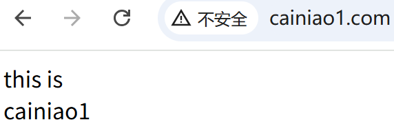
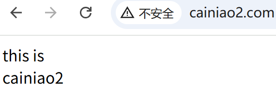
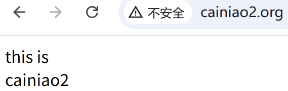

## servername的多种匹配方式

### 同一端口配置不同域名

#### 提前准备

本地主机配置hosts文件

```shell
C:\Windows\System32\drivers\etc\hosts
# nginx验证同一端口配置不同域名
192.168.52.60 cainiao1.com
192.168.52.60 cainiao2.com
```

虚拟主机做以下配置

```shell
root@debian:/var/www# mkdir cainiao1 cainiao2
root@debian:/var/www# echo 'this is <br> cainiao1' > cainiao1/index.html
root@debian:/var/www# echo 'this is <br> cainiao2' > cainiao2/index.html
```

#### 配置nginx

```nginx
# 将以下内容防止配置文件http模块最后
root@debian:~# vim /etc/nginx/nginx.conf
    server {
        listen 80;
        server_name cainiao1.com;

        location / {
            root /var/www/cainiao1;
            index  index.html index.htm;
            expires 30d;
        }
    }
    server {
        listen 80;
        server_name cainiao2.com;

        location / {
            root /var/www/cainiao2;
            index  index.html index.htm;
            expires 30d;
        }
    }

# 重新加载配置
root@debian:~# systemctl reload nginx.service
```

#### 验证





### 不同域名指向同一访问路径

#### 提前准备

本地主机配置hosts文件

```shell
C:\Windows\System32\drivers\etc\hosts
# nginx验证同一端口配置不同域名
192.168.52.60 cainiao1.com
192.168.52.60 cainiao2.com
192.168.52.60 xxoo.cainiao1.com
192.168.52.60 xx.cainiao1.com
192.168.52.60 oo.cainiao1.com
192.168.52.60 cainiao2.org
192.168.52.60 cainiao2.net
```

#### 配置nginx

**注意：server_name配置域名时，域名间有空格**

```nginx
root@debian:~# vim /etc/nginx/nginx.conf
    server {
        listen 80;
        # server_name cainiao1.com xxoo.cainiao1.com xx.cainiao1.com oo.cainiao1.com;
        server_name cainiao1.com *.cainiao1.com;  # 可以使用*通配符

        location / {
            root /var/www/cainiao1;
            index  index.html index.htm;
            expires 30d;
        }
    }
    server {
        listen 80;
        server_name cainiao2.*;

        location / {
            root /var/www/cainiao2;
            expires 30d;
        }
    }
    
# 重新加载配置
root@debian:~# systemctl reload nginx.service
```

#### 验证




## 负载均衡参数详解

### nginx配置

```nginx
root@debian:/opt/tomcat8082# cat /etc/nginx/conf.d/default.conf
upstream myServers {
    server 127.0.0.1:8081 weight=4 down;
    server 127.0.0.1:8082 weight=1 backup;
    server 127.0.0.1:8083 weight=1 max_fails=3 fail_timeout=10s slow_start=30s;
}

server {
    listen       80;
    server_name  localhost;

    location / {
        #        root   /usr/share/nginx/html;
        #        index  index.html index.htm;
        proxy_pass   http://myServers;
    }
......
}
```

**配置说明**

- **`weight`** 在实际生产中使用普遍，主要根据服务器配置、网络带宽对集群权重进行调整。权重越高，分配的请求越多。
- **`down`** 标记某个后端服务器为不可用状态，nginx不转发请求到此服务器。**实际中几乎不用**。
- **`backup`** 用于将某台服务器标记为备用服务器。只有当所有非备用服务器不可用时，才会将请求分配到备用服务器。
- **`max_fails` 和 `fail_timeout`** 在 `fail_timeout` 时间窗口内允许的最大失败次数（`max_fails`）。
- **`resolve`** 动态解析域名，适用于后端服务器使用域名的情况。
- **`slow_start`** 当服务器从 `down` 状态恢复时，逐渐增加其权重。

**顺序说明**

虽然 Nginx 的 `upstream` 参数顺序不影响功能，但为了代码的规范性和可读性，建议按照以下顺序书写参数：

1. 服务器地址（IP 或域名）
2. `weight`
3. `max_fails` 和 `fail_timeout`
4. `backup`
5. `down`
6. 其他参数（如 `resolve`、`slow_start` 等）

这样可以确保配置清晰易懂，便于后续维护和调试。

### 负载均衡算法

**实际配置情况**

**`Round Robin（轮询）`** 生产中使用这种，生产系统使用无状态会话技术即可。

**`Least Connections（最少连接）`** 生产中不用，后端服务无法会话保持。

**`IP Hash`** 生产中不用，移动端IP变化后，后端服务无法会话保持。

**`Generic Hash`** url hash 定向流量转发，固定资源不在统一服务器，才用的到。**可能会出现流量偏移**。

**`Random`** 生产中不用，后端服务无法会话保持。

## Nginx 的正则表达式

Nginx 的正则表达式（Regular Expressions）主要用于 `location` 块、`rewrite` 指令、`if` 条件等场景中，用于匹配 URL 或其他字符串。Nginx 使用的是 **PCRE（Perl Compatible Regular Expressions）** 库，因此其语法与 Perl 的正则表达式兼容。

### 正则表达式的基本语法

Nginx 的正则表达式语法与 PCRE 一致，以下是一些常用的元字符和语法：

| 元字符  | 描述                                                         |
| ------- | ------------------------------------------------------------ |
| `.`     | 匹配任意单个字符（除换行符 `\n` 外）                         |
| `*`     | 匹配前面的字符 0 次或多次                                    |
| `+`     | 匹配前面的字符 1 次或多次                                    |
| `?`     | 匹配前面的字符 0 次或 1 次                                   |
| `{n}`   | 匹配前面的字符恰好 n 次                                      |
| `{n,}`  | 匹配前面的字符至少 n 次                                      |
| `{n,m}` | 匹配前面的字符至少 n 次，至多 m 次                           |
| `^`     | 匹配字符串的开头                                             |
| `$`     | 匹配字符串的结尾                                             |
| `\`     | 转义字符，用于匹配特殊字符（如 `.`、`*` 等）                 |
| `[]`    | 字符集，匹配其中任意一个字符（如 `[abc]` 匹配 `a`、`b` 或 `c`） |
| `[^]`   | 否定字符集，匹配不在其中的任意字符（如 `[^abc]` 匹配非 `a`、`b`、`c` 的字符） |
| `       | `                                                            |
| `()`    | 分组，用于捕获匹配的内容或定义子表达式                       |

### Nginx 中的正则表达式匹配

在 Nginx 中，正则表达式通常用于以下场景：

#### **`location` 块中的正则匹配**

`location` 块可以使用正则表达式匹配 URL。正则表达式必须以 `~`（区分大小写）或 `~*`（不区分大小写）开头。

- **区分大小写匹配**：

  ```nginx
  location ~ \.php$ {
      # 匹配以 .php 结尾的 URL
  }
  ```

- **不区分大小写匹配**：

  ```nginx
  location ~* \.(jpg|jpeg|png|gif)$ {
      # 匹配以 .jpg、.jpeg、.png 或 .gif 结尾的 URL，不区分大小写
  }
  ```

#### **`rewrite` 指令中的正则匹配**

`rewrite` 指令可以使用正则表达式匹配 URL 并进行重写。

- 示例：

  ```nginx
  rewrite ^/old/(.*)$ /new/\$1 permanent;
  ```

  解释：

  - `^/old/(.*)$`：匹配以 `/old/` 开头的 URL，并捕获后面的内容。
  - `/new/\$1`：将匹配的 URL 重写为 `/new/` 加上捕获的内容。
  - `permanent`：返回 301 永久重定向。

#### **`if` 条件中的正则匹配**

`if` 指令可以使用正则表达式进行条件判断。

- 示例：

  ```nginx
  if ($request_uri ~* "^/admin") {
      return 403;
  }
  ```

  解释：

  - 如果请求的 URL 以 `/admin` 开头（不区分大小写），则返回 403 状态码。

### 正则表达式的捕获与引用

在 Nginx 中，正则表达式的捕获内容可以通过 `\$1`、`\$2` 等变量引用。

- 示例：

  ```nginx
  location ~ ^/user/(\d+)$ {
      proxy_pass http://backend/user/\$1;
  }
  ```

  解释：

  - `(\d+)`：捕获 URL 中的数字部分。
  - `\$1`：引用捕获的内容。

### 综合示例

以下是一个综合示例，展示了正则表达式在 Nginx 中的使用：

```nginx
server {
    listen 80;
    server_name example.com;

    # 匹配以 /user/ 开头的 URL，并捕获用户 ID
    location ~ ^/user/(\d+)$ {
        proxy_pass http://backend/user/\$1;
    }

    # 匹配以 .jpg、.jpeg、.png 或 .gif 结尾的 URL，不区分大小写
    location ~* \.(jpg|jpeg|png|gif)$ {
        access_log off;
        expires 30d;
    }

    # 重写 /old/ 开头的 URL 到 /new/
    rewrite ^/old/(.*)$ /new/\$1 permanent;

    # 如果请求的 URL 以 /admin 开头，返回 403
    if ($request_uri ~* "^/admin") {
        return 403;
    }
}
```

